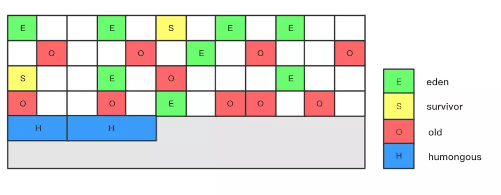

一个GC部分简单的连环炮。
面试官可以先问你什么时候一个对象会被GC？　　接着继续问你为什么要在这种时候对象才会被GC？　　接着继续问你GC策略都有哪些分类？　　你如果说出来了，继续问你这些策略分别都有什么优劣势？都适用于什么场景？　　你继续说出来了以后，给你举个实际的场景，让你选择一个GC策略？　　你如果选出来了，继续问你，为什么要选择这个策略？

下面是关于类加载机制的简单连环炮。首先肯定是先问你Java的类加载器都有哪些？　　回答了这些以后，可能会问你每个类加载器都加载哪些类？　　说完以后，可能会问你这些类加载之间的父子关系是怎样的？　　你在回答的时候可能会提到双亲委派模型，那么可以继续问你什么是双亲委派模型？　　你解释完了以后，可能会继续问你，为什么Java的类加载器要使用双亲委派模型？　　你回答完以后，可能会继续问你如何自定义自己的类加载器，自己的类加载器和Java自带的类加载器关系如何处理？

再来一个关于内存的连环炮。首先肯定就是问你JVM内存分为哪几部分，这些部分分别都存储哪些数据？　　然后继续问你一个对象从创建到销毁都是怎么在这些部分里存活和转移的？　　接着可能会问你，内存的哪些部分会参与GC的回收？　　完事以后，可能还会问你Java的内存模型是怎么设计的？　　你回答了以后，还会继续问你为什么要这么设计？　　问完以后，还可能会让你结合内存模型的设计谈谈volatile关键字的作用？　　你在谈的时候，肯定会提到可见性，那么接着可见性这三个字，还可以继续问你并发的内容。

内存泄漏和内存溢出


## 第1章 Java内存区域
1. 意义   
    虽然java虚拟机有自动内存管理机制，不容易出现内存泄漏和溢出问题，但是，一旦出现内存泄漏和溢出方面的问题，如果不了解虚拟机是怎样使用内存的，那么排查错误将会成为一项异常艰难的工作。
1. JVM & JDK & JRE
    * jdk:.java编译成.class所需工具 & 对JVM监控的工具
    * jre:.class-->机器语言（01010）的工具
    * JRE包含JVM
2. JVM运行时数据区   
   图1
    * 程序计数器：指向当前线程正在执行的字节码指令的地址（行号），线程CPU调度的最小单位（进程是资源分配的最小单位），CPU时间片是可以被强占的，所以要记住行号。JVM中唯一一个没有规定任何OutOfMemoryError情况的区域。
    * 虚拟机栈：存储当前线程运行方法所需要的**数据、指令和返回地址**。（单位栈帧） (局部变量表（编译时期确认大小），操作数栈，动态链接（多态），返回地址)   。每个方法在执行的同时都会创建一个栈帧，用于存储局部变量表、操作数栈、动态链接、方法出口等信息。每一个方法从调用直至执行完成的过程，就对应着一个栈帧在虚拟机中入栈到出站的过程。
      栈深度异常（StackOverflowError）&内存溢出异常(OutOfMemoryError)
    * 本地方法栈：native.略 
    * 方法区：类信息、常量（1.7）、静态变量(static)、JIT、运行时常量池。有的人称为“永久代”   
    * heap:  -Xmx,-Xms-->大小可扩展
   

## 第2章 垃圾回收器与内存分配策略
### 2.1. 判断对象已死吗

#### 2.1.1 引用计数算法   

给对象中添加一个引用计数器，每当有一个地方引用他时，计数器值+1；当引用失效时，计数器值-1，任何时刻计数器值为0的对象就是不能再被使用的。   
**高效简单，但不能解决循环引用的问题。**

#### 2.1.2 可达性分析算法   

通过一系列的称为“GC Roots”的对象作为起始点，从这些节点开始向下搜索，搜索走过的路径称为引用链（Reference Chain），当一个对象到GC Roots没有任何引用链相连（图论术语：从GC Roots到这个对象是不可到达的），则此对象是不可用的。   
Java中可作为GC Roots的对象包括：

* 虚拟机栈（栈帧中的局部变量表）中引用的对象。
* 方法区中类静态属性引用的对象。
* 方法区中常量引用的对象。
* 本地方法栈中JNI引用的对象。

**关于GC roots的深度解析**

其实很好理解GC roots，它们要么就是活着的线程产生的JVM栈的栈帧Frame中正在被直接使用的对象(可以通过有效的局部变量获得)，要么就是JVM本身需要它们长期驻留的，比如方法区里面的类的static/final数据，它们有两个特点：

1. 语义上是活的，还有用的

2. 可以方便获取的

**GC roots必须可以方便获取，这样GC的标记才能从这些可以快速获取的GC roots开始**，然后对GC roots能到达的对象图进行标记。否则还要花很多代价才能找到标记的输入点。另外一点，枚举GC roots是需要STW的，即使是号称不会发生停顿的CMS收集器中。

最初的虚拟机很多采用保守式GC，不记录这些信息，实现简单但是效率低。现在主流的虚拟机都采用**准确式的GC**，尽量早和方便地收集这些信息，加快整个标记的速度。

方法区的类对象的静态数据和final数据作为GC roots很好理解，它们要长期存在，并且在类加载的时候就可以确定内存位置。**获取GC roots最主要的部分在解决如何快速找到JVM栈的栈帧的局部变量表中的局部变量所引用的对象**。

当STW后，JVM并不需要一个不漏地检查完所有执行上下文和全局的引用位置，应该有办法直接得知那些地方存放着对象引用。JVM采用了**一组OopMap这个数据结构记录了GC roots** 。

**OopMap何时记录GC roots**

在类加载完成的时候，HotSpot就把对象什么偏移量上是什么类型的数据计算出来，在JIT编译过程中，也会在特定的位置记录下栈和寄存器中哪些位置是引用的。这些特殊位置，被称为**安全点**。

OopMap会在安全点收集数据。在JIT编译模式下，Java代码被编译后就确定了OopMap如何采集，它会插入相应的机器码在safepoint的时候做这个工作。 

记实际上是GC最重要的一个事情，因为只有标记成功了，就相当于确定了那些对象是活的，另外的对象就是死的。那么接下来的清除工作就可以不用stop the world，可以并发地去清除死的对象了。所以标记的时候大部分是需要stop the world的。 

### 2.2 生存还是死亡   
   * 即使在可达性分析算法中不可达的对象，也不是“非死不可”，一个对象死亡，至少需要经历两次标记过程：不可达->标记第一次且进行一次筛选，筛选的条件是此对象是否有必要执行finalize()方法。当对象没有覆盖此方法或者已经被调用过，那么就没必要执行。   
   * 如果有必要执行finalize()方法，那么这个对象将会放置在一个叫做F-Queue的队列中，并在稍后由一个虚拟机自动建立的、低优先级的Finalizer线程去执行它。这里的“执行”是指虚拟机会触发这个方法，但并不承诺会等待他运行结束，这样做的原因是，如果一个对象在finalize()方法执行缓慢，或者放生了死循环，很有可能导致F-Queue队列中其他对象永远处于等待，甚至导致整个内存回收系统崩溃。
   * finalize()方法是对象逃脱死亡的最后一次机会，稍后GC将对F-Queue队列中的对象进行第二次小规模的标记，如果对象在finalize中重新与引用链上的任何一个对象建立关联（把自己的this关键字赋值给某个类变量或对象的成员变量），那么第二次标记时它将被移除“即将回收”的集合。如果对象这个时候还没逃脱，那么就真的回收了。
   * 注意，任何一个对象的finalize()方法都只会被系统自动调用一次，如果此对象面临下一次回收，那么finalize()方法不被执行。
   * 不建议使用finalize()方法去拯救对象。运行代价高昂，不确定性大，无法保证各个对象的调用顺序。finalize可以做的，tyr-finally或其他方式都可以做的更好。
### 2.3 回收方法区（HotSpot虚拟机中的永久代）
* java虚拟机规范说过可以不要求虚拟机在方法区实现垃圾收集，而且在方法区垃圾收集的性价比很低。
* 永久代垃圾回收两部分：废弃常量和无用的类。无用的类满足下面三个条件:
    * java堆中不存在该类的任何实例
    * 加载该类的ClassLoader已经被回收
    * 该类对应的java.lang.Class对象没有在任何地方被引用、无法再任何地方通过反射访问该类的方法。
### 2.4 垃圾收集算法
* 标记-清除算法   
    * 先标记处所有需要回收的对象，标记完成后统一回收所有被标记的对象，优点是**不需要移动内存**。
    * 缺点：   
    1. 两个过程的效率都不高，标记过程将暂停运行程序，等清除之后，才恢复运行。    
    （为什么需要暂停程序，因为假设我们程序和GC线程是一起运行的，在标记阶段，标记了A，而此时new新对象B，且A到B是可达的，那么会出现B未被标记，从而在清除阶段被清除，so,无法工作。）   
    2. 空间碎片问题，产生大量不连续的内存碎片继而导致以后在程序运行过程中需要分配大对象时，无法找到足够的连续内存而不得不提前触发另一次垃圾收集动作。

* 复制算法   
        &ensp;&ensp;为了解决效率问题，复制算法出现了。它将可用内存按容量划分为大销量等的两块，每次只使用其中一块。当这块内存用完了，就将还存活着的对象复制到另外一块上面，然后再把已使用过的内存空间一次清理掉。这样使得每次都是对整个半区进行内存回收。   
        &ensp;&ensp;但是其实不用按照1:1划分内存，HotSpot虚拟机默认Eden和Survivor的大小比例是8:1，也就是每次新生代中可用内存空间是整个新生代用量的90%(80%+10%),当Survivor空间不够用时，需要依赖其他内存（这里指老年代）进行分配担保。    
        &ensp;&ensp;为什么需要两个Survivor区？设置两个Survivor区最大的好处就是解决了碎片化刚刚新建的对象在Eden中，一旦Eden满了，触发一次Minor GC，Eden中的存活对象就会被移动到Survivor区。这样继续循环下去，下一次Eden满了的时候，问题来了，此时进行Minor GC，Eden和Survivor各有一些存活对象，如果此时把Eden区的存活对象硬放到Survivor区，很明显这两部分对象所占有的内存是不连续的，也就导致了内存碎片化。      
         &ensp;&ensp;应该建立两块Survivor区，刚刚新建的对象在Eden中，经历一次Minor GC，Eden中的存活对象就会被移动到第一块survivor space S0，Eden被清空；等Eden区再满了，就再触发一次Minor GC，Eden和S0中的存活对象又会被复制送入第二块survivor space S1（这个过程非常重要，因为这种复制算法保证了S1中来自S0和Eden两部分的存活对象占用连续的内存空间，避免了碎片化的发生）。S0和Eden被清空，然后下一轮S0与S1交换角色，如此循环往复。如果对象的复制次数达到16次，该对象就会被送到老年代中。

* 标记-整理算法（压缩法）   
        &ensp;&ensp;老年代中进行垃圾收集时，存活的对象比较多，概率较大，采用复制算法效率很低。故有人提出标记-整理算法：标记，然后把所有存活的对象都向一端移动，然后直接清理掉端边界以外的内存。优点是每次压缩后剩下的可用空间都是连续的，缺点：需要大量的内存复制操作 。

* 分代收集算法   
        &ensp;&ensp;一般把java堆分为新生代和老年代，这样就可以根据各个年代的特点采用最适当的收集算法。在新生代中，每次垃圾收集时都有大批对象死去，只有少量存活，选用复制算法，只需要复制少量对象，就可以完成收集。而老年代中因为对象存活率比较高、也没有额外空间对它进行分配担保，就必须使用“标记-整理”算法回收。

* Minnor GC和full GC   
    当Eden空间不足时，发生MinorGC，新生代上的gc,而Survivor区空间不足，将触发分配担保。  
    采用复制算法，对于较大的对象，在Minnor GC的时候直接进入老年代。   

    老年代空间不足是，会触发fullGC。采用标记-清除/整理算法。发生次数低于Minnor GC，但时间大于minnorGC


### 2.5 安全点和安全区
GC在进行回收时，需要停顿。程序执行时并非在所有的地方都能够停顿下来开始GC，只有在达到安全点时才能暂停。

**哪些点可以被当做安全点？**

安全点的选定既不能太少以至于让GC等待时间太长，也不能过于频繁以至于过分增大运行时的负荷。所以，安全点的选定基本上是以程序“是否具有让程序长时间执行的特征”为标准进行选定的--因为每条指令执行的时间都非常短暂，程序不太可能因为指令流长度太长这个原因而过长时间运行，“长时间执行”的最明显的特征就是指令序列复用，例如方法调用、循环跳转、异常跳转等，所以具有这些功能的指令才会产生安全点。

**如何让GC发生时，所有的线程都跑到最近的安全点上再停顿下来？**

当GC需要中断线程的时候，不直接对线程操作，仅仅简单的设置一个标志，各个线程执行时主动去轮询这个标志，发现中断标志位真时，就把自己中断挂起。轮询标志的地方和安全点是重合的。

**安全区**

有时候线程处于sleep状态或者Blocked状态是，这时候线程无法响应JVM的中断请求，跑到安全的地方中断挂起，这个时候需要安全区来解决。

**安全区是指在一段代码片段中，引用关系不会发生变化**。在这个区域中的任意地方开始GC都是安全的。

在线程执行到安全区中的代码时，首先标志自己已经进入了安全区。那么当在这段时间JVM要发起GC时，就不用管标志自己为安全区状态的线程了。在线程要离开安全区时，他会检查系统是否已经完成了GC过程，如果完成了，那线程就继续执行，否则他就必须等待直到收到可以安全离开安全区的信号为止。

### 2.6 垃圾收集规则

规则一：通常情况下，对象在eden中分配。当eden无法分配时，触发一次Minor GC。 

规则二：配置了PretenureSizeThreshold的情况下，对象大于设置值将直接在老年代分配。 

规则三：在eden经过GC后存活，并且survivor能容纳的对象，将移动到survivor空间内，如果对象在survivor中继续熬过若干次回收（默认为15次）将会被移动到老年代中。回收次数由MaxTenuringThreshold设置。  

规则四：如果在survivor空间中相同年龄所有对象大小的累计值大于survivor空间的一半，大于或等于个年龄的对象就可以直接进入老年代，无需达到MaxTenuringThreshold中要求的年龄。  

规则五：在Minor GC触发时，会检测之前每次晋升到老年代的平均大小是否大于老年代的剩余空间，如果大于，改为直接进行一次Full GC，如果小于则查看HandlePromotionFailure设置看看是否允许担保失败，如果允许，那仍然进行Minor GC，如果不允许，则也要改为进行一次Full GC。  

​	一共有多少对象在GC之前是无法明确知道的，所以取之前每一次GC晋升到老年代对象容量的平均值与老年代的剩余空间进行比较决定是否进行Full GC来让老年代腾出更多空间，因为JVM认为这一次Minor GC晋升到老年代的对象大小和之前是一样的。  

## 第3章 HotSpot中的垃圾收集器

### 3.1 垃圾收集器介绍

垃圾收集器就是收集算法的具体实现，不同的虚拟机会提供不同的垃圾收集器。并且提供参数供用户根据自己的应用特点和要求组合各个年代所使用的收集器。本文讨论的收集器基于Sun Hotspot虚拟机1.7版。  


图中展示了Hotspot JVM1.7中实现了多种垃圾收集器，两个收集器之间存在连线的话就说明它们可以搭配使用。 **没有最好的收集器，也没有万能的收集器，只有最合适的收集器。**  

单线程GC收集器包括Serial和SerialOld这两款收集器，分别用于年轻代和老年代的垃圾收集工作。后来，随着CPU多核的普及，为了更好了利用多核的优势，开发了ParNew收集器。多线程收集器还包括Parallel Scavenge和ParallelOld收集器，这两款也分别用于年轻代和老年代的垃圾收集工作，不同的是，它们是两款可以利用多核优势的多线程收集器。 

相对来说更加复杂的还有CMS收集器。这款收集器，在运行的时候会分多个阶段进行垃圾收集，而且在一些阶段是可以和应用线程并行运行的，提高了这款收集器的收集效率。 

#### 3.1.1 Serial收集器  　　

单线程收集器，“单线程”的语义并不仅仅只会使用一个CPU或一条收集线程去完成垃圾收集工作，更重要的是，收集时会暂停所有工作线程（STW），直到收集结束。


当然他也有有点：简单而高效（相对于其他收集器的单线程）。虚拟机运行在Client模式时的默认新生代收集器，对于运行在Client模式下的虚拟机来说是一个很好的选择 。  

采用的是Cheney算法的变种。广度优先遍历的典型实现思路是三色遍历：

给对象赋予白、灰、黑三种颜色以标记其遍历状态： 

 * 白色：未遍历到的对象  
 * 灰色：已遍历到但还未处理完的对象（意味着该对象尚有未遍历到的出边）  
 * 黑色：已遍历完的对象  

遍历过程：  

* 一开始，所有对象都是白色的；
* 把根集合能直接碰到的对象标记为灰色。在只有一个根对象的地方就只要把那个对象标记为灰色。但GC通常不是只有一个特定根对象，而是有一个集合的引用作为根，这些引用能直接碰到的对象都要标记为灰色。  
* 然后逐个扫描灰色对象的出边，把这些边能直接碰到的对象标记为灰色。每当一个对象的所有出边都扫描完了，就把这个对象标记为黑色。 
* 重复第3步直到不再有灰色对象，遍历结束。  

这黑白灰要怎么跟实际实现联系起来呢？基本算法会使用一个队列（queue）与一个集合：

* 所有没进入过scanning队列的对象是白色的；  
* 进入了scanning队列与scanned集合，但还没离开scanning队列的对象是灰色的； 
* 离开了scanning队列并且在scanned集合里的对象是黑色的。  

#### 3.1.2 ParNew收集器  

ParNew收集器就是Serial的多线程版本，除了使用多条收集线程外，其余行为包括算法、STW、对象分配规则、回收策略等都与Serial收集器一摸一样。对应的这种收集器是虚拟机运行在Server模式的默认新生代收集器，在单CPU的环境中，ParNew收集器并不会比Serial收集器有更好的效果。  

ParNew收集器是许多运行在Server模式下的虚拟机中首选新生代收集器，其中有一个与性能无关但很重要的原因是，除Serial收集器之外，目前只有ParNew它能与CMS收集器配合工作。 

#### 3.1.3 Parallel Scavenge收集器  

Parallel Scavenge收集器（下称PS收集器）也是一个多线程收集器，也是使用复制算法，但它的对象分配规则与回收策略都与ParNew收集器有所不同，其他收集器的关注点是尽可能地缩短垃圾收集时用户线程的停顿时间，而PS收集器是以吞吐量最大化（即GC时间占总运行时间最小）为目标的收集器实现，**它允许较长时间的STW换取总吞吐量最大化。**

吞吐量=运行用户代码时间/(运行用户代码时间+垃圾收集时间)。**停顿时间越短，越适合需要与用户交互的程序。**而吞吐量最大化可以高效率利用CPU时间，尽快完成程序的运算任务，主要适用于在**后台运算而不需要太多的交互任务。**

PS收集器设置了两个参数：最大垃圾收集停顿时间、吞吐量大小。但停顿时间设置稍小一点是以牺牲吞吐量和新生代空间换取的。系统把新生代调小一些，收集300M新生代比收集500M快，但是这样会导致垃圾收集频繁。原来10s收集一次，每次停顿100ms；现在变成5s收集一次，一次停顿70ms。虽然停顿时间下降，但是吞吐量也下来了。

但PS收集器提供了自适应调节策略，不需要我们去指定上述两个参数用以优化。

#### 3.1.4 Serial Old收集器  

Serial Old是单线程收集器，使用标记－整理算法。主要意义是用于Client模式下的虚拟机使用。如果是Server模式下，那么他有两大用途：一是JDK1.5以及之前版本中雨PS收集器搭配使用，二是作为CMS收集器的后备预案，在并发收集发生Concurrent Mode Failure时使用。

#### 3.1.5 Parallel Old收集器  

Parallel Old是PS收集器的老年代版本，使用多线程和标记－整理算法，JVM 1.6提供，在此之前，新生代使用了PS收集器的话，老年代除Serial Old外别无选择，因为PS无法与CMS收集器配合工作。 而PS+serial Old的组合的吞吐量甚至不如ParNew+CMS的组合给力。 

直到Parallel Old出现以后，PS+Parallel Old的组合可以在注重吞吐量以及CPU资源敏感的场合使用。

#### 3.1.6 CMS（Concurrent Mark Sweep）收集器  

　CMS是一种以**最短停顿时间**为目标的收集器，使用CMS并不能达到GC效率最高（总体GC时间最小），但它能尽可能降低GC时服务的停顿时间，这一点对于实时或者高交互性应用（譬如证券交易、互联网站、B/S系统）来说至关重要，这类应用重视服务的响应速度，对于长时间STW一般是不可容忍的。

CMS收集器使用的是标记－清除算法，整个过程分为4个步骤：

1. 初始标记
2. 并发标记
3. 重新标记
4. 并发清除

其中初始标记和重新标记两个过程需要STW。初始标记仅仅只是标记一下GC roots能直接关联到的对象，速度很快；并发标记阶段就是进行GC roots Tracing的过程；重新标记阶段则是为了修正并发标记期间用户程序继续运作而导致标记产生变动的那一部分对象的标记记录，这个阶段的停顿时间一般会比初始阶段稍长一些，但是远比并发标记的时间短。

由于整个过程中耗时最长的并发标记和并发清除过程收集器线程都可以与用户线程一起工作，所以，总体上说，CMS收集器的内存回收过程是与用户线程一起并发执行的。下图是整个过程的解释：


##### CMS的缺点

CMS具有并发收集、低停顿的优点，但CMS还远达不到完美的程度，他有以下几个显著缺点：

**CMS收集器对CPU资源非常敏感，比较消耗CPU资源**

如果在CPU负载本来就比较大的环境中执行收集器线程，就可能导致用户程序的执行速度忽然下降。i-CMS在并发标记、清理时让GC线程、用户线程交替运行，尽量减少GC线程独占资源的时间，这样整个垃圾收集的过程会更长，但用户感觉响应速度下降没有那么快。不过i-CMS已经废弃

**CMS收集器无法处理浮动垃圾，可能出现“Concurrent Mode Failure”失败而导致另一次Full GC的产生**

由于CMS并发清理阶段用户线程还在运行着，自然有新的垃圾产生，这一部分垃圾出现在标记过程之后，CMS无法在当次收集中处理掉他们，只好留在下一次GC时再处理，这部分垃圾称为浮动垃圾。

所以，需要预留足够的内存空间给用户线程使用，因此，CMS垃圾收集器不会像其他收集器那样等到老年代几乎完全被填满了再进行收集。JDK1.5中的默认是68%的老年代空间被使用时，CMS收集器被激活，JDK1.6，默认阈值为92%，可以使用参数调节这个阈值。

如果CMS收集器运行期间预留的内存无法满足程序的需要，就会出现一次“Concurrent Mode Failure”失败，这时候虚拟机启动后背预案：临时启动Serial Old收集器来重新进行老年代的垃圾收集，这样停顿时间就很长了。所以，这个阈值过高，可能导致大量的“Concurrent Mode Failure”失败，性能反而降低。

**大量空间碎片产生**

CMS收集器使用“标记-清除”算法，意味着收集结束时会有大量的空间碎片产生。碎片太多，将会给分配大对象带来很大麻烦，往往会出现老年代还有很大空间剩余，但是无法找到足够大的连续空间来分配给对象，不得不提前触发一次Full GC。

为了解决这个问题，CMS收集器顶不住要进行Full GC时开启内存碎片的合并整理过程，内存整理过程是无法并发的，由此带来停顿时间变长。另外提供了参数设置执行多少次不压缩的Full GC后，跟着来一次带压缩的Full GC。（默认值为0，表示每次都压缩）

#### 3.1.7 G1收集器

为解决CMS算法产生空间碎片和其它一系列的问题缺陷，HotSpot提供了另外一种垃圾回收策略，G1（Garbage First）算法。

以往的垃圾回收算法，都有几个共同点：

1. 年轻代、老年代是独立且连续的内存块；
2. 年轻代收集使用单eden、双survivor进行复制算法；
3. 老年代收集必须扫描整个老年代区域；
4. 都是以尽可能少而块地执行GC为设计原则。

G1收集器与以往的收集器有很大的不同：

- G1的设计原则是"首先收集尽可能多的垃圾(Garbage First)"。因此，G1并不会等内存耗尽(串行、并行)或者快耗尽(CMS)的时候开始垃圾收集，而是在内部采用了启发式算法，在老年代找出具有高收集收益的分区进行收集。同时G1可以根据用户设置的暂停时间目标自动调整年轻代和总堆大小，暂停目标越短年轻代空间越小、总空间就越大；
- G1采用内存分区(Region)的思路，将内存划分为一个个相等大小的内存分区，回收时则以分区为单位进行回收，存活的对象复制到另一个空闲分区中。由于都是以相等大小的分区为单位进行操作，因此G1天然就是一种压缩方案(局部压缩)；
- G1虽然也是分代收集器，但整个内存分区不存在物理上的年轻代与老年代的区别，也不需要完全独立的survivor(to space)堆做复制准备。G1只有逻辑上的分代概念，或者说每个分区都可能随G1的运行在不同代之间前后切换；
- G1的收集都是STW的，但年轻代和老年代的收集界限比较模糊，采用了混合(mixed)收集的方式。即每次收集既可能只收集年轻代分区(年轻代收集)，也可能在收集年轻代的同时，包含部分老年代分区(混合收集)，这样即使堆内存很大时，也可以限制收集范围，从而降低停顿。

在G1算法中，采用了另外一种完全不同的方式组织堆内存，堆内存被划分为多个大小相等的内存块（Region），每个Region是逻辑连续的一段内存，结构如下： 



每个Region被标记了E、S、O和H，说明每个Region在运行时都充当了一种角色，其中H是以往算法中没有的，它代表Humongous，这表示这些Region存储的是巨型对象（humongous object，H-obj），当新建对象大小超过Region大小一半时，直接在新的一个或多个连续Region中分配，并标记为H。

**Region**

 堆内存中一个Region的大小可以通过`-XX:G1HeapRegionSize`参数指定，大小区间只能是1M、2M、4M、8M、16M和32M，总之是2的幂次方。默认把堆内存按照2048份均分，最后得到一个合理的大小。 

**Card**

在每个分区内部又被分成了若干个大小为512 Byte卡片(Card)，标识堆内存最小可用粒度所有分区的卡片将会记录在全局卡片表(Global Card Table)中，分配的对象会占用物理上连续的若干个卡片，当查找对分区内对象的引用时便可通过记录卡片来查找该引用对象(见RSet)。每次对内存的回收，都是对指定分区的卡片进行处理。

G1跟踪各个Region里面的垃圾堆积的价值大小（回收所获得的空间大小以及回收所需时间的经验值），在后台维护一个优先级列表，每次根据允许的收集时间，优先回收价值最大的Region（这也是G1名字的由来）。这种方式保证了G1在有限的时间内可以获取尽可能高的收集效率。

**使用Region划分内存的问题**

有一个问题需要解决，那就是Region不可能是孤立的。一个对象分配在某个Region中，它并非只能被本Region中的其他对象引用，而是可以与整个Java堆中任意的对象发生引用关系，那么在做可达性分析时，岂不是要对全堆做一个扫描？这个问题不是G1独有，但G1更为突出，其他收集器分代收集，新生代比老年代要小很多，如果每次新生代的回收也需要扫描老年代的话，那么Minor GC的效率可能也会下降。

G1使用Remembered Set来避免全堆扫描。G1中每个Region都有一个与之对应的Remembered Set，虚拟机发现程序在对Reference类型的数据进行写操作时，会产生一个Write Barrier暂时中断写操作，检查Reference引用的对象是否处于不同的Region之中（在分代的例子中就是检查是否老年代中的对象引用了新生代中的对象），如果是，便通过CardTable把相关引用信息记录到被引用对象所属的Region的Remembered Set。当进行内存回收时，在GC根节点的枚举范围中加入Remembered Set即可保证不对全堆扫描也不会有遗漏。

**GC模式**

G1中提供了三种模式垃圾回收模式，young gc、mixed gc 和 full gc，在不同的条件下被触发。 

1. young gc

   发生在年轻代的GC算法，一般对象（除了巨型对象）都是在eden region中分配内存，当所有eden region被耗尽无法申请内存时，就会触发一次young gc，这种触发机制和之前的young gc差不多，执行完一次young gc，活跃对象会被拷贝到survivor region或者晋升到old region中，空闲的region会被放入空闲列表中，等待下次被使用。

   | 参数                    | 含义                                |
   | ----------------------- | ----------------------------------- |
   | -XX:MaxGCPauseMillis    | 设置G1收集过程目标时间，默认值200ms |
   | -XX:G1NewSizePercent    | 新生代最小值，默认值5%              |
   | -XX:G1MaxNewSizePercent | 新生代最大值，默认值60%             |

2. mixed gc 

   当越来越多的对象晋升到老年代old region时，为了避免堆内存被耗尽，虚拟机会触发一个混合的垃圾收集器，即mixed gc，该算法并不是一个old gc，除了回收整个young region，还会回收一部分的old region，这里需要注意：是一部分老年代，而不是全部老年代，可以选择哪些old region进行收集，从而可以对垃圾回收的耗时时间进行控制。

   那么mixed gc什么时候被触发？

   先回顾一下cms的触发机制，如果添加了以下参数：

   ```java
   -XX:CMSInitiatingOccupancyFraction=80 
   -XX:+UseCMSInitiatingOccupancyOnly
   ```

   当老年代的使用率达到80%时，就会触发一次cms gc。相对的，mixed gc中也有一个阈值参数 `-XX:InitiatingHeapOccupancyPercent`，当老年代大小占整个堆大小百分比达到该阈值时，会触发一次mixed gc.。

   mixed gc的执行过程有点类似cms，主要分为以下几个步骤：

   1. initial mark: 初始标记过程，整个过程STW，标记了从GC Root可达的对象

   2. concurrent marking: 并发标记过程，整个过程gc collector线程与应用线程可以并行执行，标记出GC Root可达对象衍生出去的存活对象，并收集各个Region的存活对象信息

   3. remark: 最终标记过程，虚拟机将这段时间（并发标记）内对象变化记录在线程Remembered Set Log里面，然后把Remembered Set Log的数据合并到Remembered Set中，，整个过程STW，但是可以并行执行。

   4. clean up: 垃圾清除过程，首先对各个Region的回收价值和成本进行排序，根据用户所期望的GC停顿时间来制定回收计划，这个阶段可以与用户程序一起并发执行。

      整个过程

3. full gc（一般是G1出现问题时发生） 

   如果对象内存分配速度过快，mixed gc来不及回收，导致老年代被填满，就会触发一次full gc，G1的full gc算法就是单线程执行的serial old gc，会导致异常长时间的暂停时间，需要进行不断的调优，尽可能的避免full gc。

#### 3.1.8 ZGC

ZCG是一个mark-compact GC，但是GC过程中所有的阶段都设计为可以并发的，包括移动对象的阶段 。但是依然有三个非常短暂的STW。其中第一个是做根集合（root set）扫描，包括全局变量啊线程栈啊啥的里面的对象指针，但不包括GC堆里的对象指针，所以这个暂停就不会随着GC堆的大小而变化（不过会根据线程的多少啊、线程栈的大小之类的而变化）。另外两个暂停也同样不会随着堆大小而变化。 

这种并发的核心思想是：

* 着色标记

  标记阶段，与其说是标记对象（记录对象是否已经被标记），不如说是标记指针（记录GC堆里的每个指针是否已经被标记）。这就与传统的三色标记对象的GC算法有非常大的区别，虽然两者从收敛性上看是等价的——最终所有对象以及所有指针都会被遍历过。

* 读屏障

  在标记和移动对象的阶段，每次从GC堆里的对象的引用类型字段里读取一个指针的时候，这个指针都会经过一个“Loaded Value Barrier”（LVB）。这是一种“Read Barrier”（读屏障），会在不同阶段做不同的事情。最简单的事情就是，在标记阶段它会把指针标记上并把堆里的这个指针给“修正”到新的标记后的值；而在移动对象的阶段，这个屏障会把读出的指针更新到对象的新地址上，并且把堆里的这个指针“修正”到原本的字段里。这样就算GC把对象移动了，读屏障也会发现并修正指针，于是应用代码就永远都会持有更新后的有效指针，而不需要通过stop-the-world这种最粗粒度的同步方式来让GC与应用之间同步。

  ```java
  void printName( Person person ) {
  String name = person.name; // 这里触发读屏障
  // 因为需要从heap读取引用
  //
  System.out.println(name); // 这里没有直接触发读屏障
  }
  ```

  LVB中有一点很重要，就是“self healing”性质：如果堆上有指针当前处于“尚未更新”的状态，一旦经过LVB之后就会被就地更新，于是在同一个GC周期内再次访问这个字段的话就不需要再修正了。这样LVB带来的性能开销（吞吐量的下降）就是非常短暂的，而不像Shenandoah GC所使用的Brooks indirection pointer那样一直都慢。

着色标记

读屏障

##### ZGC与其他收集器的不同点

* ZGC是不分代的

  Per大大 ：因为分代实现起来麻烦，想先实现出比较简单可用的版本；后续正在考量是添加分代版ZGC好还是添加一个Thread-Local GC作为ZGC的“前端”好，目前还在探索中 。

* ZGC是读屏障，其他是写屏障

### 3.2 垃圾收集器间的比较

#### 3.2.1 ParallelScavenge & ParNew

都是并行GC，主要是并行收集young gen，目的和性能其实都差不多。最明显的区别有下面几点：  

1. PS以前是广度优先顺序来遍历对象图的，JDK6的时候改为默认用深度优先顺序遍历，并留有一个UseDepthFirstScavengeOrder参数来选择是用深度还是广度优先。在JDK6u18之后这个参数被去掉，PS变为只用深度优先遍历。ParNew则是一直都只用广度优先顺序来遍历 
2. PS完整实现了adaptive size policy，而ParNew及“分代式GC框架”内的其它GC都没有实现完（倒不是不能实现，就是麻烦+没人力资源去做）。所以千万千万别在用ParNew+CMS的组合下用UseAdaptiveSizePolicy，请只在使用UseParallelGC或UseParallelOldGC的时候用它。 
3. 由于在“分代式GC框架”内，ParNew可以跟CMS搭配使用，而ParallelScavenge不能。当时ParNew GC被从Exact VM移植到HotSpot VM的最大原因就是为了跟CMS搭配使用。  
4. 在PS成为主要的throughput GC之后，它还实现了针对NUMA的优化；而ParNew一直没有得到NUMA优化的实现。  


### 七、类加载机制
##### 1. 类加载的时机   
&ensp;&ensp;类从被加载到虚拟机内存中开始，到卸载出内存为止，整个生命周期包括：加载、*验证、准备、解析*（连接）、初始化、使用、卸载7个阶段。加载、验证、准备、初始化、卸载这5个顺序是确定的，但解析不一定，它在某些情况下可以在初始化之后再开始，这是为了支持java语言的运行时绑定。

1. **有且仅有**的5中情况必须立即对类进行“初始化”（加载、验证、准备自然要在此之前开始）：
    * 遇到new、getstatic、putstatic、invokestatic这4条字节码指令时，如果类没有初始化，则需要先初始化。new对象、读取或者设置一个静态字段（被final修饰、已在编译期把结果放入常量池的静态字段除外）、调用一个类的静态方法
    * 对类进行反射调用的时候，如果类没有初始化，则需要先初始化。
    * 当初始化一个类的时候，如果发现其父类没有被初始化，则需要先初始化父类。
    * 当虚拟机启动时，用户需要指定一个要执行的主类（包含main()方法的那个类），虚拟机会先初始化这个主类。
    * 当时用JDK1.7的动态语言支持时，如果一个java.lang.invoke.MethodHandle实例最后的解析结果是REF_getStatic、REF_putstatic、REF_invokeStatic的方法句柄，并且这个方法句柄所对应的类没有进行过初始化，则需要先初始化。
2. 所有引用类的方式都不会触发初始化，称为被动引用：
  
    ```java
    class SuperClass{
        static{
            print("SuperClass init!")
        }
        public static int value=123;
    }
    class SubClass extends SuperClass{
        static{
            print("SubClass init!")
        }
    }
    public class Demo{
        public static void main(String[] args){
            print(SubClass.value);
        }
    }
    ```
    &ensp;&ensp;输出结果只有“SuperClass init”,而没有“SubClass init”。对于静态字段，只有直接定义这个字段的类才会被初始化，因此通过其子类引用父类定义的静态字段，只会触发父类的初始化而不会触发子类的初始化。
    ```java
    public class Demo{
        public static void main(String[] args){
            SuperClass[] sca = new SuperClass[10];
        }
    }
    ```
    &ensp;&ensp;没有输出“SuperClass init!”
    ```java
    class ConstClass{
        static{
            print("ConstClass init!");
        }
        public static final String HELLOWORD="hello word";
    }
    public class Demo{
        public static void main(String[] args){
        print(ConstClass.HELLOWORD);
        }
    }
    ```
    &ensp;&ensp;没有输出“ConstClass init!”,这是因为虽然引用了ConstClass类中的常量，但其实在编译阶段通过常量传播优化，已经将此常量的值存储到了Demo类中的常量池中，以后Demo对常量ConstClass.HELLOWORD的引用实际都被转换成为Demo类对自身常量池的引用
3. 接口的情况和类差不多，主要区别是第三点，一个接口在初始化时，并不要求其父接口全部都完成了初始化，只有在真正使用父接口（如引用接口中定义的常量）的时候才会初始化。
##### 2.类与类的加载器   
&ensp;&ensp;对于任意一个类，都需要由加载它的类加载器和这个类本身一同确定其在java虚拟机中的唯一性，每一个类加载器，都拥有一个独立的类名称空间。换句话说，比较两个类是否相等，只有在这两个类是由同一个类加载器的前提下才有意义，否则，即使这两个类来源于同一个Class文件，被同一个虚拟机加载，只要加载他们的类加载器不同，那这两个类比不相等。    
 &ensp;&ensp;这里所指的相等，包括代表类的Class对象的equals()方法、isAssignableFrom()方法、isInstance()方法的返回结果，也包括使用instanceof关键字做对象所属关系判定等情况。如果忽略了类加载器的影响，某些情况下会产生具有迷惑性的结果。例子：
```java
public class ClassLoaderTest{
    public static void main(String[] args){
        ClassLoader myLoader =new ClassLoader(){
            @Override
            public Class<?> loadClass(String name)throws ClassNotFoundException{
                try{
                    String fileName = name.substring(name.lastIndexOf(".")+1)+".class";
                    InputStream is =get Class().getResourceAsStream(fileName);
                    if(is==null){
                        return super.loadClass(name);
                    }
                    byte[] b=new byte[is.available()];
                    is.read(b);
                    return definaClass(name,b,0,b.length());
                } catch(IOException e){
                    throw new   ClassNotFoundException(name);
                }
            }
        };
        Object obj=myLoader.loadClass("org.fenixsoft.classloading.ClassLoaderTest").newInstance();
        System.out.println(obj.getClass);
        System.out.println(obj instanceof org.fenixsoft.classloading.ClassLoaderTest);
    }
}
```
&ensp;&ensp;运行结果：
```java
class org.fenixsoft.classloading.ClassLoaderTest
false
```
&ensp;&ensp;从输出结果的第一句看，这个对象确实是ClassLoaderTest的对象，但这个对象与改类做所属类型检测的时候却返回了false,因为虚拟机里存在两个ClassLoaderTest类，一个是由系统应用程序类加载器加载的，另一个是由我们自定义的类加载器加载的，虽然都来自于同一个Class文件，但依然是两个独立的类。
##### 3.双亲委派模型
&ensp;&ensp;从java虚拟机的角度上说，只存在两种不同的类加载器：一种是启动类加载器（Bootstrap ClassLoader）,这个类加载器是由C++实现，是虚拟机自身的一部分；另一种就是所有其他的类加载器，这些类加载器都有Java实现，独立于虚拟机外部，并且全部继承自抽象类java.lang.ClassLoader。   
&ensp;&ensp;从java开发者角度看，绝大部分java程序都会使用到以下3种系统提供的类加载器:   
* 启动类加载器（Bootstrap ClassLoader）:这个类负责将存放在<JAVA_HOME>\lib目录中的，或者被-Xbootclasspath参数所指定的路径中，并且是虚拟机是别的（仅按照文件名识别，如rt.jar，名字不符合的类库即使放在lib目录下，也不会被加载）类库加载到虚拟机内存中，主要加载的是JVM自身需要的类。启动类加载器无法被java程序直接引用，用户在编写自定义类加载器时，如果需要把加载请求委派给引导类加载器，那直接使用null代替即可。

```java
/**
Returns the class loader for the class. Some implementations may use null
to represent the bootstrap class loader. This method will return null in such
implementations if this class was loaded by the bootstrap class loader.

*/

public ClassLoader getClassLoader()	{
    ClassLoader cl = getClassLoaderO();
    if (cl==null)
        return null;
    SecurityManager sm == System.getSecurityManager();
    if (sm != null) {
        ClassLoader ccl = ClassLoader.getCalierClassLoader();
        if (ccl != null && ccl != cl && !cl.isAncestor(ccl)) {
            sm.checkPermission(SecurityConstants.GET_CLASSLOADER_PERMISSION);
        }
    }    
    return cl;
}
```
*  扩展类加载器（Extension ClassLoader）：负责加载<JAVA_HOME>\lib\ext目录中的，或者被java.ext.dirs系统变量所指定的路径中的所有类库，开发者可以直接使用扩展类加载器。
*  应用程序类加载器（Application ClassLoader）:由于这个类加载器是ClassLoader中的getSystemClassLoader()方法的返回值，所以一般也称它为系统类加载器，它负责加载用户类路径（ClassPath）上所指定的类库，开发者可以直接使用这个类加载器，若应用程序中没有自定义过自己的类加载器，一般情况下这个就是程序中默认的类加载器。   

&ensp;&ensp;类加载器之间的层次关系，称为类加载器的双亲委派模型（Parents Delegation Model）。双亲委派模型要求除了顶层的启动类加载器外，其余的类加载器都应该有自己的父类加载器。并且这里类加载器的父子关系一般不会以继承的关系实现，而是使用组合。它不是一个强制性的约束模型，而是Java设计者推荐给开发者的一种加载器实现方式。


&ensp;&ensp;双亲委派模型的工作过程是：如果一个类加载器收到了类加载的请求，它首先不会自己去尝试加载这个类，而是把这个请求委派给父类加载器去完成，每一个层次的类加载器都是如此，因此所有的加载请求最终都应该传送到顶层的启动类加载器中，只有当父加载器返回自己无法加载这个加载请求（它的搜索范围中没有找到所需的类）时，子加载器才会尝试自己去加载。
&ensp;&ensp;使用这个双亲委派模型，有一个显而易见的好处就是java类随着它的类加载器一起具备了一种带有优先级的层次关系。例如类java.lang.Object，它存放在rt.jar中，无论哪个类加载器要加载这个类，始终都要委派给启动类加载器进行加载，因此，Object类在程序的各种类加载器环境中都是同一个类。相反，如果没有使用双亲委派模型，由各个类加载器自行去加载的话，假如用户自己编写了一个称为java.lang.Object的类，并放在程序的ClassPath中，那么系统就会出现多个不同的Object类，那么程序也将会变得一片混乱。（如果真的这样做，将会发现正常编译，但运行失败,即使使用自定义的类加载器，强行用defaineClass()方法去加载一个以“java.lang”开头的类也不会成功，如果这样做，将会收到一个由虚拟机自己抛出的“java.lang.SecurityException:Prohibited package name:jave.lang”）
&ensp;&ensp;双亲委派模型对于保证java程序的稳定运作非常重要，但实现很简单，代码如下所示，先检查是否已经被加载过，若没有加载则调用父加载器的loadClass()方法，若附加在为空则默认使用启动类加载器作为父加载器。如果父加载器加载失败，抛出ClassNotFoundException异常后，在调用自己的findClass()方法进行加载。
```java
protected synchronized Class<?> loadClass(String name, boolean resolve) throws ClassNotFoundException
{
    //首先，检杳丨自求的类是否已经被加栽过了
    Class c = findLoadedClass (name);
    if (c == null) {
        try {
            if (parent != null) {
                c = parent.loadClass(name, false);
            } else {
                c = lindBootstrapClassOrNull (name);
            )
        } catch (ClassNotFoundException e> {
        //如果父类加栽器摊出ClassNotFoundException
        //说明父类加鼓器无法完成扣栽请求
        }
        if (c == null）{
        //在父类加载器无法加载的时候
        //再消用本身的findClass方法来进行类加裁
            c = findClass(name);
        }
    )
    if (resolve)(
        resolveClass(c);
    }
    return c;
}
```
##### 4.破坏双亲委派模型
&ensp;&ensp;java里绝大部分的类加载器都遵循双亲委派模型，但也有例外，到目前为止，双亲委派模型一共出现过3次较大规模的“被破坏”情况。
* 双亲委派模型是jdk1.2之后引入的，而类加载器和抽象类java.lang.ClassLoader是在jdk1.0时代就已经存在了。为了兼容，jdk1.2之后的java.lang.ClassLoader添加了一个新的protected方法findClass()，在此之前，用户与继承java.lang.ClassLoader的唯一目的是为了重写loadClass()方法，因为虚拟机在进行类加载的时候回调用加载器的私有方法loadClassInternal()，而这个方法的唯一逻辑就是去调用自己的loadClass()。   
  jdk1.2之后，建议把自己的类加载逻辑写到findClass()方法中，这样就可以保证新写出来的类加载器时符合双亲委派规则的。
* 这个模型自身的缺陷导致第二次“被破坏”。双亲委派很好地解决了各个类加载器的基础类的同一问题（越基础的类由越上层的加载器进行加载）基础类之所以被称为基础，是因为他们总是作为被用户代码调用的API，但是，事情无绝对，如果基础类又要调用回用户的代码，那该怎么办？   
   一个典型的例子便是JNDI服务，它的代码由启动类加载器去加载（在jdk1.3时放进去的rt.jar），但JNDI的目的就是对资源进行集中管理和查找，他需要调用由独立厂商实现并部署在应用程序的 ClassPath下的JNDI接口提工者（SPI，Service Provider Interface）的代码，但启动类加载器不可能“认识”这些代码。   
   为了解决这个问题，java设计团队只好引入了一个不太优雅的设计：线程上下文类加载器（Thread Context ClassLoader）。这个类加载器可以通过java.lang.Thread类的setContextClassLoaser（）方法进行设置，如果创建线城市还未设置，它将从父线程中继承一个，如果在应用程序的全局范围内都没有设置过的话，那这个类加载器默认就是应用程序类加载器。   
   有了线程上下文类加载器，就使用它去加载所需要的SPI代码，也就是父类加载器请求子类加载器去完成类加载的动作，这种行为实际上就是打通了双亲委派模型的层次结构来逆向使用类加载器。但无可奈何，java中所有涉及SPI的加载动作基本上都采用这个方式，例如JNDI、JDBC、JCE、JAXB、JBI。
* 第三次“被破坏”是由于用户对程序动态性追求而导致的，这里说的动态性指的是热部署（不用重启或者更新APP）。OSGi是业界“事实上”的java模块化标准，而OSGi实现模块化热部署的关键则是它自定义的类加载器机制的实现。每一个程序模块（OSGi称为Bundle）都有一个自己的类加载器，当需要更换一个Bundel时，就把Bundle连同类加载一起换掉以实现代码的热替换。    
  在OSGi环境下，类加载器不再是双亲委派模增中的树状结构，而是进一步发展为更加
复杂的网状结构，当收到类加载请求时，OSGi将按照下面的顺序进行类搜索：   
	1. 将以java.*开头的类委派给父类加载器加载。
	2. 否则，将委派列表名单内的类委派给父类加载器加载。
	3. 否则，将Import列表中的类委派给Export这个类的Bundle的类加载器加载。
	4. 否则，查找当前Bundle的ClassPath,使用己的类加载器加载。
	5. 否则，查找类迫否在自Li的Fragment Bundle中，如果在，则委派给Fragment Bundle的类加载器加栽。
    6. 否则，査找Dynamic Impor丨列表的Bundle，委派给对应Bundle的类加栽器加载。
    7. 否则，类查找失败。   
    
    上面的查找顺序中只有开头两点仍然符合双亲委派规则，其余的类查找都Jbk在f级的类加载器中进行的。

&ensp;&ensp;只要有足够意义和理由，突破已有的原则可以认为是一种创新。正如OSGi中的类加载器并不符合传统的双亲委派模型的类加载器，并且业界对其为了实现热部署而带来的额外的高夫再度还存在不少争议，但在java程序员中基本有一个公式，OSGi中对类加载器的使用是很值得学习的，弄懂了OSGi,就掌握了类加载器的精髓。

**参考**

* [聊聊JVM](https://blog.csdn.net/ITer_ZC/article/details/41868999)
* 《深入理解Java虚拟机》
* [JVM内存管理：深入垃圾收集器与内存分配策略](https://hllvm-group.iteye.com/group/wiki/2859-JVM)
* [G1垃圾收集器介绍](https://www.jianshu.com/p/0f1f5adffdc1)