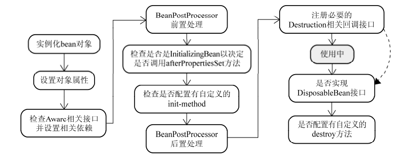
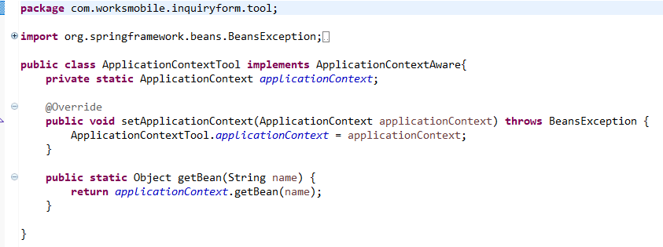
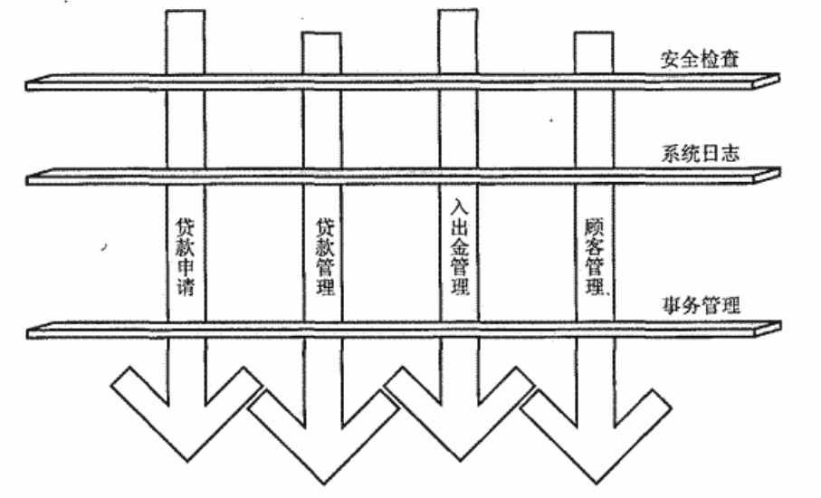

# ApplicationContext和beanfactory区别

ApplicationContext构建于 BeanFactory之上，提供了许多BeanFactory之外的特性。区别如下：

* BeanFactory不支持国际化
* Application可以在容器内部发布事件，类似于java swing中的事件机制
* ApplicationContext扩展了ResourceLoader接口，可以用来加载多个Resource 
*  BeanFactory采用延迟加载形式来注入Bean,而ApplicationContext在第一阶段完成后，紧接着调用注册到该容器的所有bean定义的实例化方法 getBean()  。这样， 在容器启动时， 我们就可以发现 Spring 中存在的配置错误。    

# Spring Bean生命周期



1. Bean的实例化与BeanWrapper

   容器在内部实现的时候，采用“策略模式（Strategy Pattern）”来决定采用何种方式初始化bean实例。 通常，    可以通过反射或者CGLIB动态字节码生成来初始化相应的bean实例或者动态生成其子类。  

   生成实例后，就可以返回实例。但是，不是直接返回构造完成的对象实例，而是以BeanWrapper对构造完成的对象实例进行包裹，返回相应的BeanWrapper实例。

2. 设置对象属性

   BeanWrapper接口通常在Spring框架内部使用，其作用是对某个bean进行“包裹”，然后对这个“包裹”的bean进行操作。设置或者获取bean的相应属性值。而在第一步结束后返回BeanWrapper实例而不是原先的对象实例， 就是为了第二步“设置对象属性”。   

   使用BeanWrapper对bean实例操作很方便，可以免去直接使用Java反射API（Java Reflection API）操作对象实例的烦琐。            

3. 检查各色的Aware接口    

   比较常用的是ApplicationAware.

   如果实现了ApplicationContextAware接口,会调用 setApplicationContext(ApplicationContext)方法， 传入 Spring 上下文。

   

4. BeanPostProcessor    

   BeanPostProcessor的概念容易与BeanFactoryPostProcessor的概念混淆。但只要记住BeanPostProcessor是存在于对象实例化阶段，而BeanFactoryPostProcessor则是存在于容器启动阶段， 这两个概念就比较容易区分了。 

   该接口声明了两个方法，分别在两个不同的时机执行，代码定义如下;

   ```java
   public interface BeanPostProcessor{
       Object postProcessBeforeInitialization(Object bean, String beanName) throws BeansException;
   	Object postProcessAfterInitialization(Object bean, String beanName) throws
   BeansException; 
   } 
   ```

   postProcessBeforeInitialization()方法是上图中BeanPostProcessor前置处理这一步将 会执行的方法， postProcessAfterInitialization()则是对应上图中BeanPostProcessor后置处 理那一步将会执行的方法。 BeanPostProcessor的两个方法中都传入了原来的对象实例的引用，这为我们扩展容器的对象实例化过程中的行为提供了极大的便利，我们几乎可以对传入的对象实例执行任何的操作。      

5. InitializingBean和init-method    

   InitializingBean是容器内部广泛使用的一个对象生命周期标识接口其定义如下：

   ```java
   public interface InitializingBean {
   	void afterPropertiesSet() throws Exception;
   }
   ```

    该接口定义很简单，其作用在于，在对象实例化过程调用过“BeanPostProcessor的前置处理” 之后，会接着检测当前对象是否实现了InitializingBean接口，如果是，则会调用其afterPropertiesSet()方法进一步调整对象实例的状态。  

   虽然该接口在Spring容器内部广泛使用，但如果真的让我们的业务对象实现这个接口，则显得 Spring容器比较具有侵入性。所以， Spring还提供了另一种方式来指定自定义的对象初始化操作，那就 是在XML配置的时候，使用\<bean>的init-method属性。    

   举个例子，为了保证getForwardDateCalculator()和getBackwardDateCalculator()方法返回的DateCalculator已经将休息日考虑进去，在这两个方法被调用之前，我们需要setupHolidays()首先被 调用，以保证将休息日告知DateCalculator，使它能够在计算交易日的时候排除掉这些休息日的日期。因此，我们需要在配置文件中完成类似下面所示的配置，以保证在对象可用之前， setupHolidays()方法会首先被调用。

   ```java
   <beans> 
   	<bean id="tradeDateCalculator" class="FXTradeDateCalculator" init-method="setupHolidays">
   		<constructor-arg> 
   			<ref bean="sqlMapClientTemplate"/> 
   		</constructor-arg>
   	</bean>
   <bean id="sqlMapClientTemplate" class="org.springframework.orm.ibatis.SqlMapClientTemplate">
   ...
   </bean>
   ...
   </beans> 
   ```

   当然，我们也可以让FXTradeDateCalculator实现InitializingBean接口，然后将setupHolidays()方法的逻辑转移到afterPropertiesSet()方法。不过，相对来说还是采用init-method 的方式比较灵活，并且没有那么强的侵入性。

   可以认为在InitializingBean和init-method中任选其一就可以帮你完成类似的初始化工作。 除非……，除非你真的那么“幸运”，居然需要在同一个业务对象上按照先后顺序执行两个初始化方法。这个时候，就只好在同一对象上既实现InitializingBean的afterPropertiesSet()，又提供自 定义初始化方法啦！  

   **以上工作完成以后就可以应用这个 Bean 了**

6. DisposableBean与destroy-method    

   当 Bean 不再需要时，会经过清理阶段， 如果 Bean 实现了 DisposableBean 这个接口，会调用那个其实现的 destroy()方法；  

   如果这个 Bean 的 Spring 配置中配置了 destroy-method 属性，会自动调 用其配置的销毁方法。 

# Spring IOC

IOC: 所谓控制反转是指， 本来被调用者的 实例是有调用者来创建的， 这样的缺点是耦合性太强， IOC 则是统一交给 spring 来管理创建， 将对 象交给容器管理， 你只需要在 spring 配置文件总配置相应的 bean， 以及设置相关的属性， 让 spring 容器来生成类的实例对象以及管理对象。 在 spring 容器启动的时候， spring 会把你在配置文件中配置 的 bean 都初始化好， 然后在你需要调用的时候， 就把它已经初始化好的那些 bean 分配给你需要调 用这些 bean 的类。 

IoC 的一个重点是在系统运行中， 动态的向某个对象提供它所需要的其他对象。 这一点是通 过 DI（Dependency Injection， 依赖注入） 来实现的。 比如对象 A 需要操作数据库， 以前我们总是 要在 A 中自己编写代码来获得一个 Connection 对象， 有了 spring 我们就只需要告诉 spring， A 中需 要一个 Connection， 至于这个 Connection 怎么构造， 何时构造， A 不需要知道。 在系统运行时， sp ring 会在适当的时候制造一个 Connection， 然后像打针一样， 注射到 A 当中， 这样就完成了对各个 对象之间关系的控制。 A 需要依赖 Connection 才能正常运行， 而这个 Connection 是由 spring 注入 到 A 中的， 依赖注入的名字就这么来的。 那么 DI 是如何实现的呢？ Java 1.3 之后一个重要特征是反 射（reflection） ， 它允许程序在运行的时候动态的生成对象、 执行对象的方法、 改变对象的属性， spring 就是通过反射来实现注入的。    

# Spring AOP

 AOP 技术利用一种称为“横切”的技术， 剖解开封装的对象内部， 并将那些影响了多个类 的公共行为封装到一个可重用模块， 并将其名为“Aspect”， 即方面。 所谓“方面”， 简单地说， 就是将那些与业务无关， 却为业务模块所共同调用的逻辑或责任封装起来， 便于减少系统的 重复代码， 降低模块间的耦合度， 并有利于未来的可操作性和可维护性。     

AOP仅仅是对OOP方法的一种补足，当我们把以Class形式模块化的业务需求和以Aspect形式模块化的系统需求拼装在一起的时候，整个系统就算完成了。



AOP应该独立于OOP的空间，才能提供最大的便利。但是目前的AOP的实现都需要“寄生于”OOP的空间中。

AOP是一种理念，要实现这种理念通常需要一种实现的方式。与OOP需要相应的语言支持一样，AOP也需要某种语言以帮助实现相应的概念，这些语言称为AOL。

囿于现实中AOP技术实现上的尴尬，AOL最终都需要以某种方式集成到系统实现语言所实现的OOP实体组件中。所以，系统实现语言通常称为系统中使用的AOL的“寄生语言”，而将AO组件集成到OOP组件的过程，叫做“织入（Weave）”过程。织入过程对于整个系统的实现是透明的。

## AOP的术语

* Joinponit 

  将要在其之上进行织入操作的系统执行点。

* Pointcut

  符合条件的一组Joinpoint，代表一类。比如全体男同学。此外，Pointcut还可以参与运算，比如||、&&。

* Advice

  单一横切关注点逻辑的载体，它代表将会织入到Joinpoint的横切逻辑。如果Aspect比作OOP中的Class，那么Advice就相当于Class中的Method。

* Aspect

  Aspect是对系统中的横切关注点逻辑进行模块化封装的AOP概念实体。通常情况下，Aspect可以包含多个Pointcut以及相关Advice定义。

* Target Object

  符合Pointcut所指定的条件，将在织入过程中被织入横切逻辑的对象。

## Spring AOP

Spring AOP使用动态代理机制，可以在运行期间，为相应的接口动态生成对应的代理对象。

### 设计模式之代理模式

http://note.youdao.com/noteshare?id=b301f228cb28431236013b4760f9c4d7

假设我们对系统的所有request()方法进行拦截，在每天的0-6点之间，request调用不被接受，那么我们应该为SubjectImpl提供一个SubjectProxy,添加逻辑，大概的代码如下：

```java
public class SubjectProxy implements ISubject{
    private ISubject o;
    public String request(){
        //执行逻辑
        o.request();
    }
    main(){
        ISubject target=new SubjectImpl();
        ISubject subjectProxy=new SubjectProxy(target);
        subjectProxy.request();
    }
}
```

### 动态代理

如果系统中存在相同的Joinpoint，但是target object不同，难道需要为每一个target object提供一个代理吗？这会死人的。

好在JDK1.3之后提供了动态代理机制，这个机制可以为指定的接口在系统运行期间动态地生成代理对象。动态代理机制的实现主要由一个类和一个接口组成，即java.lang.reflect.Proxy类和java.lang.reflect.InvocationHandler接口。大概的代码如下：

```java
public class RequestInvocationHandler implements InvocationHandler{
    public Object invoke(Object proxy,Method,method,Object[] args){
        if(method.getName().equals("request")){
            //执行逻辑
        	method.invoke(target,args);
        }
    }
}
```

动态代理虽然好，但是不能满足所有需求。因为动态代理机制只能对实现了接口的类使用。对于没有实现任何接口的target object，Spring AOP则会尝试使用CGLIB的开源动态字节码生成类库，为target object生成动态的代理对象实例。

他的原理是：我们可以对target object进行继承扩展，为其生成相应的子类，而子类可以通过覆写来扩展父类的行为，只要将横切的逻辑放在子类中，然后让系统使用扩展后的target object的子类，就可以达到与动态代理相同的效果了。


​                                  "","pkgId":"12034","pkgVer":"1","stkId":"66122879"}}]}