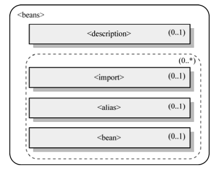
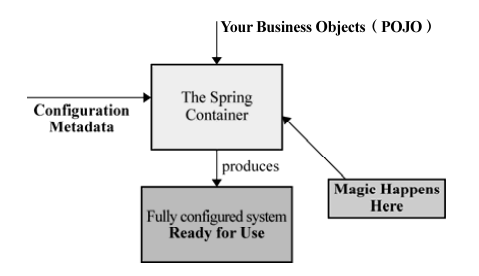
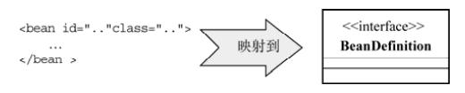

# spring

# 第一章 Spring的由来

spring没有之前，大家使用EJB开发，但是EJB太重了，并不适合所有场景。于是，Spring这款轻量级放入框架横空出世。

> 没有一种解决方案是普遍适用的，spring出现并不是取代EJB，而是在EJB之外的另外一种解决方案。

# 第二章 IOC容器

以前我们这么写代码：

```java
Person person = new Person();
//然后就可以用person对象来获取Person类提供的服务了
person.say("hellow Ioc!");
```

先不说这样做有什么不好，想一下我们的目的只是想调用person的说话服务而已，每次调用前都需要自己创建个person对象这样是否真的有必要？答案当然是no。

在上面的例子中，被注入对象直接依赖于被依赖对象(先理清这两个名词)，但实际上被注入对象并不需要关心被依赖对象具体是谁？什么时候被创建？它只需要在要用到被依赖对象的时候，被依赖对象能准备好为它服务。要实现这种模式就需要第三个对象介入，被依赖对象不需要关心的都交给它去做，这就是IOC模式。

IOC怎么知道被注入对象需要哪些被依赖对象呢 ?这就需要被注入对象去通知它。

**IOC三种注入方式**

* 构造方法注入
* setter方法注入
* 接口注入（不提倡）

# 第三章 掌管大局的IOC Service Provider

IoC Service Provider在这里是一个抽象出来的概念，它可以指代任何将IoC场景中的业务对象绑定 到一起的实现方式。它可以是一段代码，也可以是一组相关的类，甚至可以是比较通用的IoC框架或 者IoC容器实现。Spring 的IoC容器就是一个提供依赖注入服务的IoC Service Provider。


# 第四章 Spring的IoC容器之BeanFactory   

## 4.1 BeanFactory的对象注册与依赖绑定方式

**注解方式**

```xml
<?xml version="1.0" encoding="UTF-8"?>
<beans xmlns="http://www.springframework.org/schema/beans" ➥
xmlns:xsi="http://www.w3.org/2001/XMLSchema-instance" ➥
xmlns:context="http://www.springframework.org/schema/context" ➥
xmlns:tx="http://www.springframework.org/schema/tx" ➥
xsi:schemaLocation="http://www.springframework.org/schema/beans ➥
http://www.springframework.org/schema/beans/spring-beans-2.5.xsd ➥
http://www.springframework.org/schema/context ➥
http://www.springframework.org/schema/context/spring-context-2.5.xsd ➥
http://www.springframework.org/schema/tx ➥
http://www.springframework.org/schema/tx/spring-tx-2.5.xsd">
<context:component-scan base-package="cn.spring21.project.base.package"/>
</beans>
```

```<context:component-scan/>```会到指定的包（package）下面扫描标注有@Component的类，如果
找到，则将它们添加到容器进行管理，并根据它们所标注的@Autowired为这些类注入符合条件的依
赖对象。   

```java
@Component
public class FXNewsProvider{
    @Autowired
	private IFXNewsListener newsListener;
	@Autowired
	private IFXNewsPersister newPersistener;
}
```

## 4.2 BeanFactory的XML之旅    

### beans和bean    

\<beans>是XML配置文件中最顶层的元素，它下面可以包含0或者1个\<description>和多个 \<bean>以及\<import>或者\<alias>,如图所示：

​    

#### **beans的属性**

* default-lazy-init。 其值可以指定为true或者false，默认值为false。用来标志是否对所 有的\<bean>进行延迟初始化。 
*  default-autowire。 可以取值为no、 byName、 byType、 constructor以及autodetect。默 认值为no，如果使用自动绑定的话，用来标志全体bean使用哪一种默认绑定方式。 
*  default-dependency-check。 可以取值none、 objects、 simple以及all，默认值为none， 即不做依赖检查。
* default-init-method。 如果所管辖的\<bean>按照某种规则，都有同样名称的初始化方法的 话，可以在这里统一指定这个初始化方法名，而不用在每一个\<bean>上都重复单独指定。 
*  default-destroy-method。 与default-init-method相对应，如果所管辖的bean有按照某种 规则使用了相同名称的对象销毁方法，可以通过这个属性统一指定。    

可以发现\<beans>的属性主要用来做统一设置的，如果你需要对大部分的\<bean>都重复设置某些行为的话。

#### **description、import、alias**

了解一下，并不是必须的。

* \<description>  指定一些描述性的信息，一般省略
* \<import> ```<import resource="B.xml"/>```引入其他xml文件
* \<alias> bean的别名

#### bean

* 孤独的bean

  ```xml
  <bean id="djNewsListener"
        name="/news/djNewsListener,dowJonesNewsListener"
        class="..impl.DowJonesNewsListener"> 
  </bean>
  ```

  id是对象的唯一标志，name属性是别名，相当于alias。与id相比，name可以使用id不能使用的一些字符。

  class是对象的类型。

* 有依赖的bean

  * 通过构造方法注入

  ```xml
  <!--简写形式-->
  <bean id="djNewsProvider" class="..FXNewsProvider">
  	<constructor-arg ref="djNewsListener"/>
  	<constructor-arg ref="djNewsPersister"/>
  </bean>
  ```

  当对象存在多个构造方法时，容器可能区分不了对象的构造方法和参数列表的意义对应关系，可以使用type属性指定。例如：

  ```xml
  <bean id="mockBO" class="..MockBusinessObject">
      <constructor-arg type="int">
      	<value>111111</value>
      </constructor-arg>
  </bean>
  ```

  index属性可以指定参数顺序,index从0开始：

  ```xml
  <bean id="mockBO" class="..MockBusinessObject">
      <constructor-arg index="1" value="11111"/>
      <constructor-arg index="0" value="22222"/>
  </bean>
  ```

  * setter方法注入

  ```xml
  <bean id="djNewsProvider" class="..FXNewsProvider"> 
      <property name="newsListener">
          <ref bean="djNewsListener"/>
      </property> 
      <property name="newPersistener">
      	<ref bean="djNewsPersister"/>
      </property>
  </bean> 
  ```

  如果只是使用\<property>进行依赖注入的话，请确保你的对象提供了默认的构造方法。

* \<property>和\<constructor-arg>中可用的配置项    

  * \<value> 可以注入简单的数据类型，包括String、基本数据类型以及他们的包装类

  * \<ref> 引用其他对象实例，可以通过ref的local、 parent和bean属性来 指定引用的对象的beanName是什么。一般用bean。

  * \<idref> idref注入的是**目标bean的id**而不是目标bean的实例，同时使用idref容器在编译时期还会验证这个名称的bean是否真实存在。其实idref就跟value一样。

    ```xml
    <property name="newsListenerBeanName">
    	<idref bean="djNewsListener"/>
    </property>
    ```

  * 内部\<bean> 不希望其他对象引用,这个时候id不是必须的。

    ```xml
    <bean id="djNewsProvider" class="..FXNewsProvider"> 
    	<constructor-arg index="0">
    		<bean class="..impl.DowJonesNewsListener">
    		</bean>
    	</constructor-arg> 
    	<constructor-arg index="1">
    		<ref bean="djNewsPersister"/>
    	</constructor-arg> 
    </bean>
    ```

  * \<list> 注入的对象类型为java.util.List及其子类或者数组类型的依赖对象

  * \<set>

  * \<map>

  * \<props> 该元素对应配置类型为 java.util.Properties的对象依赖,特殊的map,键和值都只能是String,所以配置简单，有固定格式。

    ```xml
    public class MockDemoObject
    {
    	private Properties emailAddrs;
    	// 必要的setter和getter方法
    	...
    }
    配置类似于
    <property name="valueSet">
    	<props>
    		<prop key="author">fujohnwang@gmail.com</prop>
    		<prop key="support">support@spring21.cn</prop>
    		...
    	</props>
    </property>
    ```

  * \<null/>

* \<depends-on> 上面说的是显式依赖关系，根据这种依赖关系，容器可以很容易知道先加载哪个对象，但如果没有通过引用来明确指定A对象依赖于B对象呢？举个例子：

  ```java
  public class SystemConfigurationSetup
  {
  	static 
  	{
  		DOMConfigurator.configure("配置文件路径");
  		// 其他初始化代码
  	}
  	...
  }
  ```

  那么可以使用depends-on属性

  ```xml
  <bean id="classAInstance" class="...ClassA" depends-on="configSetup,configSetup2,..."/>
  <bean id="configSetup" class="SystemConfigurationSetup"/>
  <bean id="configSetup2" class="SystemConfigurationSetup2"/>
  ```

* \<autowire> 自动绑定，可选byName，byType

* \<dependency-check> 检查每个对象所依赖的对象是都按照预期那样被注入。none/simple/object/all

* \<lazy-init> 延迟初始化，但如果有依赖关系，可能会失效，需要把依赖的对象也设置为lazy-init。

### scope

```xml
<bean id="mockObject2" class="...MockBusinessObject" scope="prototype"/>
```

* singleton（默认） 

  在Spring的IoC容器中只存在一个实例，所有对该对象的引用将共享这个实例。该实例从容器启动，并因为第一次被请求而初始化之后，将一直存活到容器退出，也就是说，它与IoC容器“几乎”拥有相同的“寿命”。 

  > 区别GoF提出的Singleton模式：标记为singleton的bean是由容器来保证这种类型的bean在同一个容器中只存在一个共享实例； 而Singleton模式则是保证在同一个Classloader中只存在一个这种类型的实例。      

* prototype    

  器在接到该类型对象的请求的时候，会每次都重新 生成一个新的对象实例给请求方。对象实例返回给请求方之后，容器就不再拥有当前返回对象的引用。请 求方需要自己负责当前返回对象的后继生命周期的管理工作，包括该对象的销毁。        

以下三个是2.0之后新增的，只适用于Web应用程序

* request

  为 每 个 HTTP 请 求 创建 一 个 全 新的RequestProcessor对象供当前请求使用，当请求结束后，该对象实例的生命周期即告结束。    

* session

  为每个独立的session创建属于它们自己的全新的UserPreferences对象实例。对于Web应用来说，放到session中的最普遍的信息就是用户的登录信息。        

* global session

### 工厂方法与FactoryBean

* 静态工厂方法

  假设某个第三方库发布了BarInterface，为了向使用该接口的客户端对象屏蔽以后可能对 BarInterface实现类的变动，同时还提供了一个静态的工厂方法实现类StaticBarInterfaceFactory，代码如下：

  ```java
  public class StaticBarInterfaceFactory
  {
  	public static BarInterface getInstance(){
          return new BarInterfaceImpl();
      }
  }
  ```

  将该静态工厂方法类返回的实现注入Foo :

  ```xml
  <bean id="foo" class="...Foo">
  	<property name="barInterface">
  		<ref bean="bar"/>
  	</property>
  </bean>
  <bean id="bar" class="...StaticBarInterfaceFactory" factory-method="getInstance"/>
  ```

   某些时候，有的工厂类的工厂方法可能需要参数来返回相应实例 ，可以通过\<constructor-arg>来指定工厂方法需 要的参数 :

  ```xml
  <bean id="foo" class="...Foo">
      <property name="barInterface">
      	<ref bean="bar"/>
      </property>
  </bean>
  <bean id="bar" class="...StaticBarInterfaceFactory" factory-method="getInstance">
  	<constructor-arg>
  		<ref bean="foobar"/>
  	</constructor-arg>
  </bean>
  <bean id="foobar" class="...FooBar"/>
  ```

* 非静态工厂方法

  ```java
  public class NonStaticBarInterfaceFactory
  { 
      public BarInterface getInstance(){
      	return new BarInterfaceImpl();
      } 
  ...
  }
  ```

  如下配置：

  ```xml
  <bean id="foo" class="...Foo"> 6
  	<property name="barInterface">
  		<ref bean="bar"/>
  	</property>
  </bean> 
  <bean id="barFactory" class="...NonStaticBarInterfaceFactory"/>
  <bean id="bar" factory-bean="barFactory" factory-method="getInstance"/>
  ```

* 自己实现工厂方法

  有时候创建对象的逻辑十分复杂，我们想使用java代码去创建对象，而不是xml文件，spring为我们提供了这样一个接口;

  ```java
  public interface FactoryBean {
      bject getObject() throws Exception;
  	Class getObjectType();
  	boolean isSingleton();
  }
  ```

  一个例子：

  ```java
  import org.joda.time.DateTime;
  import org.springframework.beans.factory.FactoryBean;
  public class NextDayDateFactoryBean implements FactoryBean {
      public Object getObject() throws Exception {
          return new DateTime().plusDays(1);
      }
      public Class getObjectType() {
     	    return DateTime.class;
      }
  	public boolean isSingleton() {
  		return false;
  	}
  }
  ```

  要使用NextDayDateFactoryBean，只需要如下这样将其注册到容器即可：    

  ```xml
  <bean id="nextDayDateDisplayer" class="...NextDayDateDisplayer">
  	<property name="dateOfNextDay">
  		<ref bean="nextDayDate"/>
  	</property>
  </bean>
  <bean id="nextDayDate" class="...NextDayDateFactoryBean">
  </bean>
  ```

  我们来看看NextDayDateDisplayer类：

  ```java
  public class NextDayDateDisplayer
  {
      private DateTime dateOfNextDay;
      // 相应的setter方法
      // ...
  }
  ```

  看到了吗，dateOfNextDay的类型是DateTime，而不是NextDayDateFactoryBean。也就是说FactoryBean类型的bean定义，通过正常的id引用，容器返回的是FactoryBean所“生产”的对象类型，而非FactoryBean实现本身。
## 4.3 容器背后的秘密

### 容器的两个阶段

Spring的IoC容器所起的作用，如下图所示（摘自Spring官方参考文档）。它会以某种方式加载Configuration Metadata（通常也就是XML格式的配置信息），然后根据这些信息绑定整个系统的对象，最终组装成 一个可用的基于轻量级容器的应用系统。    

  

Spring的IoC容器实现以上功能的过程，基本上可以按照类似的流程划分为两个阶段，即容器启动阶段和Bean实例化阶段。

  #### 1.容器启动阶段

容器启动伊始，首先会通过某种途径加载Configuration MetaData。除了代码方式比较直接，在大部分情况下，容器需要依赖某些工具类BeanDefinitionReader对加载的Configuration MetaData进行解析和分析，并将分析后的信息编组为相应的BeanDefinition，最后把这些保存了bean定义必要信息的BeanDefinition，注册到相应的BeanDefinitionRegistry，这样容器启动工作就完成了。下图演示了这个过程 。

  ​      

总地来说，该阶段所做的工作可以认为是准备性的，重点更加侧重于对象管理信息的收集。当然， 一些验证性或者辅助性的工作也可以在这个阶段完成。    

  #### 2. Bean实例化阶段

当某个请求方通过容器的getBean方法明确地请求某个对象，或者因依赖关系容器 需要隐式地调用getBean方法时，就会触发第二阶段的活动。 

该阶段，容器会首先检查所请求的对象之前是否已经初始化。如果没有，则会根据注册的 BeanDefinition所提供的信息实例化被请求对象，并为其注入依赖。如果该对象实现了某些回调接 口，也会根据回调接口的要求来装配它。当该对象装配完毕之后，容器会立即将其返回请求方使用。 如果说第一阶段只是根据图纸装配生产线的话，那么第二阶段就是使用装配好的生产线来生产具体的 产品了。

  ### 插手第一阶段

  Spring提供了一种叫做BeanFactoryPostProcessor的容器扩展机制。该机制允许我们在容器实 例化相应对象之前，对注册到容器的BeanDefinition所保存的信息做相应的修改。       

  #### 1. PropertyPlaceholderConfigurer    

  PropertyPlaceholderConfigurer允许我们在XML配置文件中使用占位符（PlaceHolder）， 并将这些占位符所代表的资源单独配置到简单的properties文件中来加载。    

  ```xml
  <beans>
  	<bean class="org.springframework.beans.factory.config.PropertyPlaceholderConfigurer">
  		<property name="locations"> 9
  			<list>
  				<value>conf/jdbc.properties</value>
  				<value>conf/mail.properties</value>
  			</list>
  		</property>
  	</bean>
  ... 
  </beans>
  ```

  ```xml
  <bean id="dataSource" class="org.apache.commons.dbcp.BasicDataSource" 
  destroy-method="close">
      <property name="url">
      	<value>${jdbc.url}</value>
      </property>
      <property name="driverClassName">
      	<value>${jdbc.driver}</value>
  	</property> 
  </bean>
  ```

  当BeanFactory在第一阶段加载完成所有配置信息时， BeanFactory中保存的对象的属性信息还只是以占位符的形式存在，如\${jdbc.url}、 \${jdbc.driver}。

  当PropertyPlaceholderConfigurer作为BeanFactoryPostProcessor被应用时，它会使用properties配置文件中的配置信息来替换相应BeanDefinition中占位符所表示的属性值。这样，当进入容器实现的第二阶段实例化bean时， bean定义中的属性值就是最终替换完成的了。

  #### 2.PropertyOverrideConfigurer    

   通过PropertyOverrideConfigurer对容器中配置的任何你想处理的bean定义的property信息进行覆盖替换。   

   下面是针对dataSource定义给出的PropertyOverrideConfigurer的propeties文件配置信息：

  ```xml
  # pool-adjustment.properties 11
  dataSource.minEvictableIdleTimeMillis=1000
  dataSource.maxActive=50
  ```

  这样， 当按照如下代码，将PropertyOverrideConfigurer加载到容器之后， dataSource原来定义的默认值就会被pool-adjustment.properties文件中的信息所覆盖：

  ```xml
   <bean class="org.springframework.beans.factory.config.PropertyOverrideConfigurer"> <property name="location" value="pool-adjustment.properties"/> </bean>
  ```

   pool-adjustment.properties中没有提供的配置项将继续使用原来XML配置中的默认值。    

   #### 3.CustomEditorConfigurer    

  不管对象是什么类型，通常都是通过 XML（或者properties甚至其他媒介）文件格式来配置这些对象类型。但XML所记载的，都是String类 型，但最终应用程序却是由各种类型的对象所构成。 要想完成这种由字符串到具体对象的转换（不管这个转换工作最终由谁来做），都需要这种转换规则 相关的信息，而CustomEditorConfigurer就是帮助我们传达类似信息的。

  Spring框架还提供了自身实现的一些PropertyEditor：

   * StringArrayPropertyEditor   

     将 符 合 CSV 格 式 的 字 符串 转 换 成 String[]数组的形式，默认是以逗号（，）分隔的字符串，但可以指定自定义的字符串分隔 符。     

   * ClassEditor

     根据String类型的class名称，直接将其转换成相应的Class对象，相当于通 过Class.forName(String)完成的功效。    

   * FileEditor

   * LocaleEditor

   * PatternEditor 

  以上这些PropertyEditor，容器通常会默认加载使用，所以，即使我们不告诉容器应该如何对 这些类型进行转换，容器同样可以正确地完成工作。但当我们需要指定的类型没有包含在以上所提到 的 PropertyEditor之 列的 时候 ， 就需 要给 出 针对 这种 类 型的 PropertyEditor实 现 ， 并 通 过 CustomEditorConfigurer告知容器，以便容器在适当的时机使用到适当的PropertyEditor。     

  ##### 自定义PropertyEditor    

  ### 了解Bean的一生

   

  ​    

