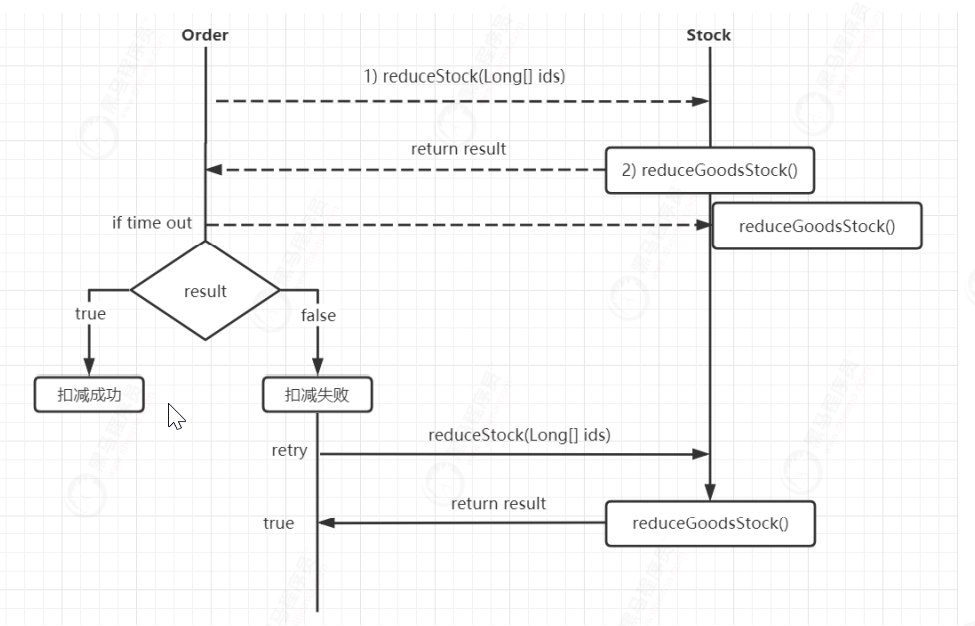
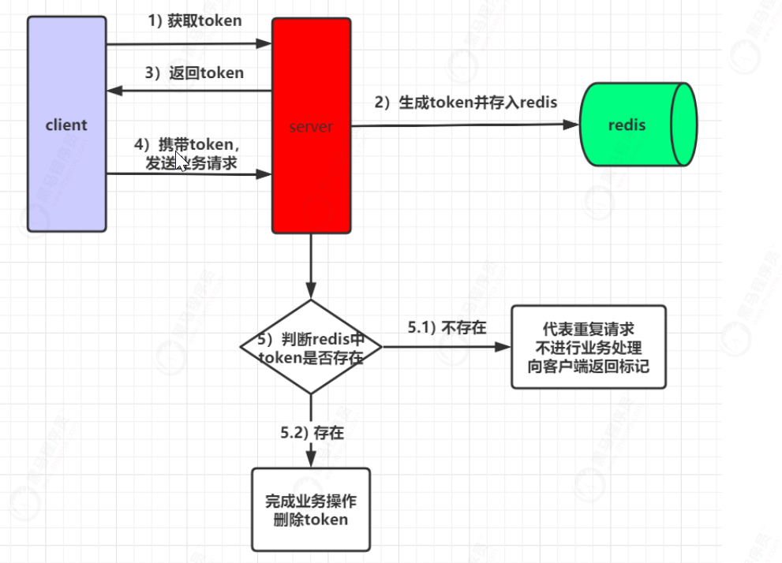
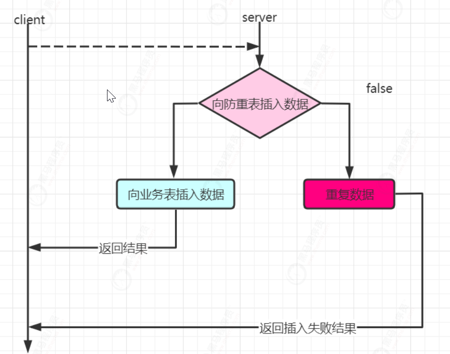
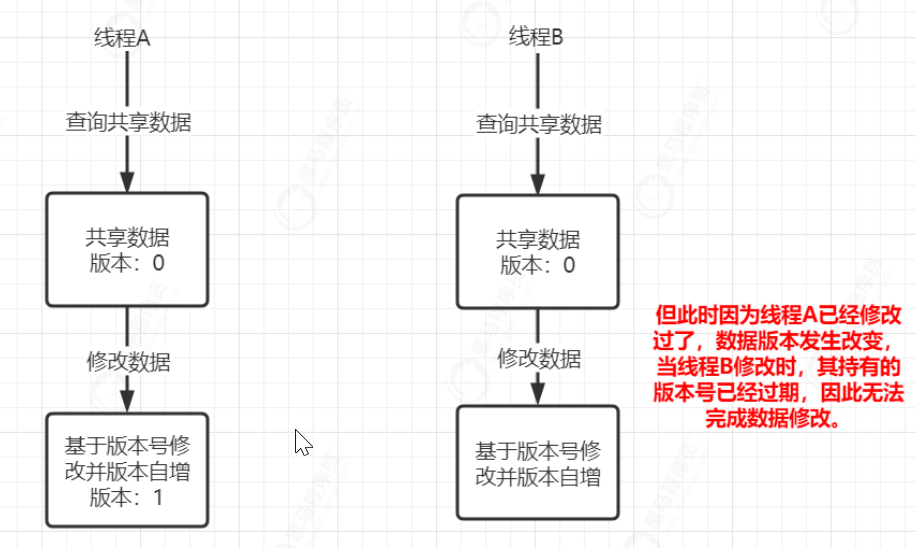
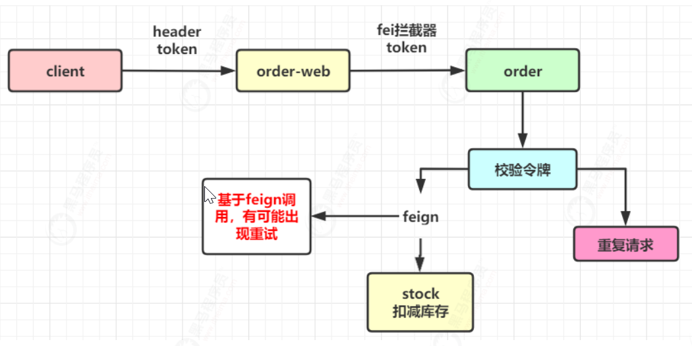
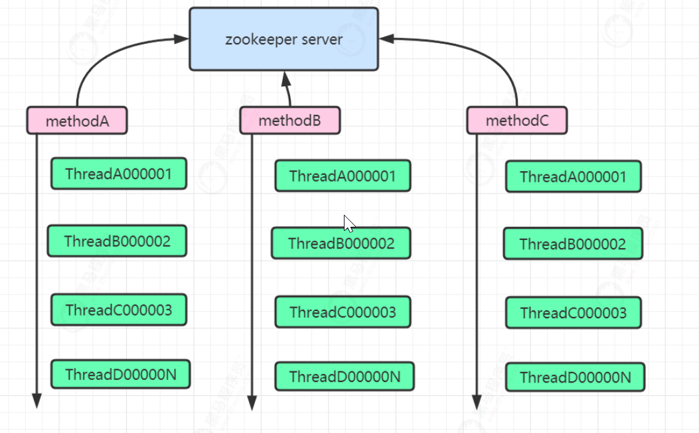
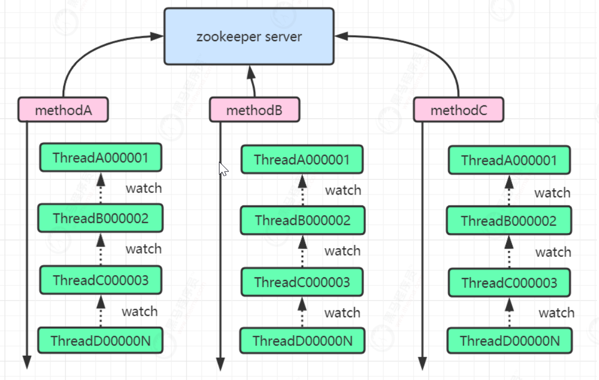
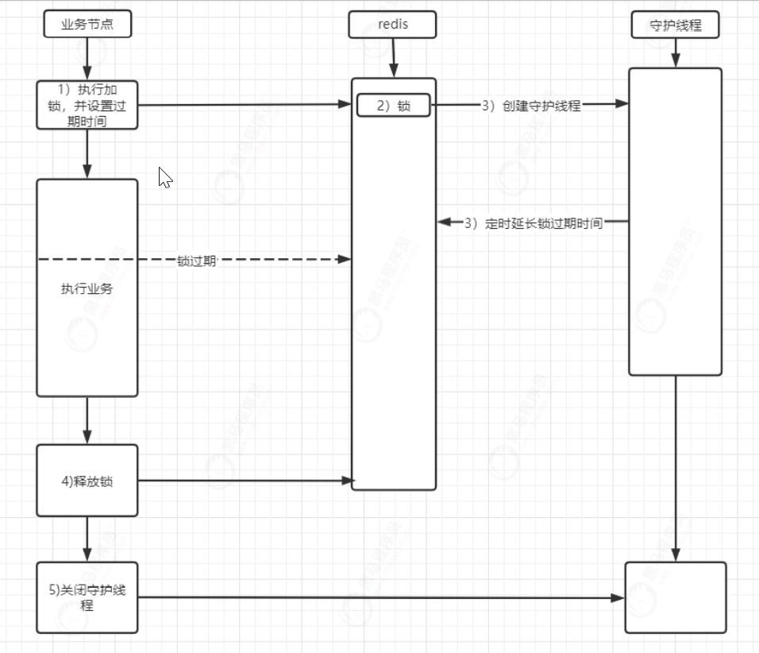
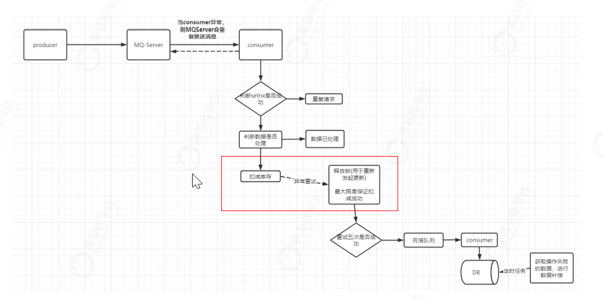

## 幂等性

### 1）简介

幂等性：在接口重复调用的情况下，对系统产生的影响是一样的，但是返回值允许不同，如查询。幂等关注的是是否对资源产生影响，而不关注结果。 

幂等性设计主要从两个维度进行考虑：空间、时间。 

* 空间：定义了幂等的范围，如生成订单的话，不允许出现重复下单。 
* 时间：定义幂等的有效期。有些业务需要永久性保证幂等，如下单、支付等。而部分业务只要保证一段时间 幂等即可。 

同时对于幂等的使用一般都会伴随着出现锁的概念，用于解决并发安全问题。 

### 2）问题的提出

对于现在的分布式系统，经常性的考虑重试、重发等操作，一旦产生这些操作，则必须要考虑幂等性问题。

以交易系 统、支付系统等尤其明显，如： 

* 当用户购物进行下单操作，用户操作多次，但订单系统对于本次操作只能产生一个订单。 
* 当用户对订单进行付款，支付系统不管出现什么问题，应该只对用户扣一次款。 
* 当支付成功对库存扣减时，库存系统对订单中商品的库存数量也只能扣减一次。 
* 当对商品进行发货时，也需保证物流系统有且只能发一次货 

以下单减库存为例，当用户生成订单成功后，会对订单中商品进行扣减库存。 订单服务会调用库存服务 进行库存扣减。库存服务会完成具体扣减实现。 

现在对于功能调用的设计，有可能出现调用超时，因为出现如网络抖动，虽然库存服务执行成功了，但结果 并没有在超时时间内返回，则订单服务也会进行重试。那就会出现问题，stock对于之前的执行已经成功了， 只是结果没有按时返回。而订单服务又重新发起请求对商品进行库存扣减。 此时出现库存扣减两次的问题。 对于这种问题，就需要通过幂等性进行结果。 



### 3）接口幂等

通过token机制来保证幂等是一种非常常见的解决方案，同时也适合绝大部分场景。该方案需要前后端进行一定程 度的交互来完成。 



1. 服务端提供获取token接口，供客户端进行使用。服务端生成token后，如果当前为分布式架构，将token存放 于redis中，如果是单体架构，可以保存在jvm缓存中。 
2. 当客户端获取到token后，会携带着token发起请求。 
3. 服务端接收到客户端请求后，首先会判断该token在redis中是否存在。如果存在，则完成进行业务处理，业务 处理完成后，再删除token。如果不存在，代表当前请求是重复请求，直接向客户端返回对应标识。 

但是现在有一个问题，当前是先执行业务再删除token。在高并发下，很有可能出现第一次访问时token存在，完 成具体业务操作。但在还没有删除token时，客户端又携带token发起请求，此时，因为token还存在，第二次请求 也会验证通过，执行具体业务操作。 

1）解决方案一：并行变串行

对于业务代码执行和删除token整体加线程锁。当后续线程再来访问时，则阻塞排队。 

缺点：会造成一定性能损耗与吞吐量降低。

2）**解决方案二：先删除token，然后在做业务操作**

这种方案无需进行额外处理，一个token只能代表一次请求。一旦业务执行出现异常，则让客户端重新获取令牌， 重新发起一次访问即可。推荐使用先删除token方案 。

> 有时间可以看看代码

### 4）服务幂等

####4.1 防重表

首先创建一张表 作为防重表，同时在该表中建立一个或多个字段的唯一索引作为防重字段，用于保证并发情况下，数据只有一条。 在向业务表中插入数据之前先向防重表插入，如果插入失败则表示是重复数据。 



对于防重表的解决方案，可能有人会说为什么不使用悲观锁。悲观锁在使用的过程中也是会发生死锁的。悲观锁是 通过锁表的方式实现的。 假设现在一个用户A访问表A（锁住了表A），然后试图访问表B； 另一个用户B访问表 B（锁住了表B），然后试图访问表A。 这时对于用户A来说，由于表B已经被用户B锁住了，所以用户A必须等到用 户B释放表B才能访问。 同时对于用户B来说，由于表A已经被用户A锁住了，所以用户B必须等到用户A释放表A才 能访问。此时死锁就已经产生了。 

#### 4.2 select+insert防重提交 

```java
@Override
@Transactional(rollbackFor = Exception.class)
public String addOrder(Order order) {
	order.setCreateTime(new Date());
	order.setUpdateTime(new Date());
	//查询
	Order orderResult = orderMapper.selectByPrimaryKey(order.getId());
	Optional<Order> orderOptional = Optional.ofNullable(orderResult);
	if (orderOptional.isPresent()){
		return "repeat request";
	}
	int result = orderMapper.insert(order);
	if (result != 1){
		return "fail";
	}
	return "success";
}
```

对于上述功能实现，在并发下，并不能完成幂等性控制。 

要解决这个问题，非常简单，在数据库层面添加唯一索引即可，将id设置为唯一索引，一 旦id出现重复，就会出现异常，避免了脏数据的发生也可以解决永久性幂等。但该方案无法用于分库分表情况，其 只适用于单表情况。 

#### 4.3 MySQL乐观锁 

假设现在订单已经生成成功，那么就会涉及到扣减库存的操作。当高并发下同时扣减库存时，非常容易出现数据错 误问题。 

通过jemeter进行测试，可以发现。当模拟一万并发时，最终的库存数量是错 误的。这主要是因为当多线程访问时，一个线程读取到了另外线程未提交的数据造成。 

```java
update tb_stock set amout=amout-#{num} where goods_id=#{goods_id}
```

##### 4.3.1 synchronized失效问题 

对于现在的问题，暂不考虑秒杀设计、队列请求串行化等，只考虑如何通过锁进行解决，要通过锁解决的话，那最 先想到的可能是synchronized。根据synchronized定义，当多线程并发访问时，会对当前加锁的方法产生阻塞， 从而保证线程安全，避免脏数据。但是，真的能如预期的一样吗？ 

```java
@Service
public class StockServiceImpl implements StockService {
	@Autowired
	private StockMapper stockMapper;
	@Override
	@Transactional(rollbackFor = Exception.class)
	public synchronized int lessInventory(String goodsId, int num) {
		return stockMapper.lessInventory(goodsId, num);
	}
}
```

当前已经在在方法上添加了synchronized，对当前方法对象进行了锁定。 通过Jemeter，模拟一万并发对其进行 访问。可以发现，仍然出现了脏数据。 

该问题的产生原因，就在于在方法上synchronized搭配使用了@Transactional。首先synchronized锁定的是当 前方法对象，而@Transactional会对当前方法进行AOP增强，动态代理出一个代理对象，在方法执行前开启事 务，执行后提交事务。 所以synchronized和@Transactional其实操作的是两个不同的对象，换句话说就是 @Transactional的事务操作并不在synchronized锁定范围之内。 

假设A线程执行完扣减库存方法，会释放锁并提交事务。但A线程释放锁但还没提交事务前，B线程执行扣减库存方 法，B线程执行后，和A线程一起提交事务，就出现了线程安全问题，造成脏数据的出现。 

##### 4.3.2 MySQL乐观锁保证幂等 

MySQL乐观锁是基于数据库完成分布式锁的一种实现，实现的方式有两种：基于版本号、基于条件。但是实现思 想都是基于MySQL的行锁思想来实现的。 

1) 基于版本号的实现



```java
@Update("update tb_stock set amount=amount‐#{num},version=version+1 where goods_id=#{goodsId}
and version=#{version}")
```

2) 基于条件实现

通过版本号控制是一种非常常见的方式，适合于大多数场景。但现在库存扣减的场景来说，通过版本号控制就是多 人并发访问购买时，查询时显示可以购买，但最终只有一个人能成功，这也是不可以的。其实最终只要商品库存不 发生超卖就可以。那此时就可以通过条件来进行控制。 

```java
@Update("update tb_stock set amount=amount‐#{num} where goods_id=#{goodsId} and amount‐#
{num}>=0")
```

#### 4.4 乐观锁控制服务间的幂等

在系统中，不光要保证客户端访问的幂等性，同时还要保证服务间幂等。比较常见的情况，当服务间进行调用时， 因为网络抖动等原因出现超时，则很有可能出现数据错误。此时在分布式环境下，就需要通过分布式事务或分布式 锁来保证数据的一致性。分布式锁的解决方案中MySQL乐观锁就是其中一种实现。  

  

解决方法：

1) 版本号+防止超卖

```java
@Update("update tb_stock set version=version+1,amount=amount‐#{num} where goods_id=#{goodsId}
and version=#{version} and amount‐#{num}>=0")
int reduceStock(@Param("goodsId") String goodsId,@Param("num") Integer num,@Param("version")
Integer version);
```

2）controller

```java
@PutMapping("/reduceStock/{goodsId}/{num}/{version}")
public int reduceStock(@PathVariable("goodsId") String goodsId,
	@PathVariable("num") Integer num,
	@PathVariable("version") Integer version) throws InterruptedException {
	System.out.println("exec reduce stock");
	int result = stockService.reduceStock(goodsId, num, version);
	if (result != 1){
		//扣减失败
		return result;
	} 
	TimeUnit.SECONDS.sleep(6000);
	return result;
}
```

3）使用场景

mysql乐观锁更适用于一些需要计数的表上，而且在竞争不激烈，出现并发冲突几率较小时，推荐使用乐观锁。

虽然通过MySQL乐观锁可以完成并发控制，但锁的操作是直接作用于数据库上，这样就会在一定程度上对数据库性能产生影响。

并且mysql的连接数量是有限的，如果出现大量锁操作占用连接时，也会造成MySQL的性能瓶颈。

#### 4.5 ZoomKeep分布式锁

对于分布式锁的实现，zookeeper天然携带的一些特性能够很完美的实现分布式锁。其内部主要是利用znode节点 特性和watch机制完成。    

##### 4.5.1 znode节点

在zookeeper中节点会分为四类，分别是： 

* 持久节点：一旦创建，则永久存在于zookeeper中，除非手动删除。 
* 持久有序节点：一旦创建，则永久存在于zookeeper中，除非手动删除。同时每个节点都会默认存在节点序 号，每个节点的序号都是有序递增的。如demo000001、demo000002.....demo00000N。 
* 临时节点：当节点创建后，一旦服务器重启或宕机，则被自动删除。 
* 临时有序节点：当节点创建后，一旦服务器重启或宕机，则被自动删除。同时每个节点都会默认存在节点序 号，每个节点的序号都是有序递增的。如demo000001、demo000002.....demo00000N。    

##### 4.5.2 watch监听机制    

watch监听机制主要用于监听节点状态变更，用于后续事件触发，假设当B节点监听A节点时，一旦A节点发生修 改、删除、子节点列表发生变更等事件，B节点则会收到A节点改变的通知，接着完成其他额外事情。    

##### 4.5.3 实现原理

其实现思想是当某个线程要对方法加锁时，首先会在zookeeper中创建一个与当前方法对应的父节点，接着每个要
获取当前方法的锁的线程，都会在父节点下创建一个临时有序节点，因为节点序号是递增的，所以后续要获取锁的
线程在zookeeper中的序号也是逐次递增的。根据这个特性，当前序号最小的节点一定是首先要获取锁的线程，因
此可以规定序号最小的节点获得锁。所以，每个线程再要获取锁时，可以判断自己的节点序号是否是最小的，如果
是则获取到锁。当释放锁时，只需将自己的临时有序节点删除即可。



根据上图，在并发下，每个线程都会在对应方法节点下创建属于自己的临时节点，且每个节点都是临时且有序的。 那么zookeeper又是如何有序的将锁分配给不同线程呢？ 这里就应用到了watch监听机制。每当添加一个新的临时 节点时，其都会基于watcher机制监听着它本身的前一个节点等待前一个节点的通知，当前一个节点删除时，就轮 到它来持有锁了。然后依次类推。    



优缺点：

1、zookeeper是基于cp模式，能够保证数据强一致性。    

2、基于watch机制实现锁释放的自动监听，锁操作性能较好。    

3、频繁创建节点，对于zk服务器压力较大，吞吐量没有redis强。    

##### 4.5.4 核心代码

// todo

1）低效的，所有节点监听第一个节点

2）高效的，所有节点监听前一个节点

#### 4.5 redis 分布式锁

##### 4.5.1 原理

分布式锁的一个很重要的特性就是互斥性，同一时间内多个调用方加锁竞争，只能有一个调用方加锁成功。而 redis是基于单线程模型的，可以利用这个特性让调用方的请求排队，对于并发请求，只会有一个请求能获取到 锁。 

redis实现分布式锁也很简单，基于客户端的几个API就可以完成，主要涉及三个核心API： 

* setNx()：向redis中存key-value，只有当key不存在时才会设置成功，否则返回0。用于体现互斥性。 
* expire()：设置key的过期时间，用于避免死锁出现。 
* delete()：删除key，用于释放锁。    

##### 4.5.2 实现

1）编写工具类实现加锁 

通过jedis.set进行加锁，如果返回值是OK，代表加锁成功 

如果加锁失败，则自旋不断尝试获取锁，同时在一定时间内如果仍没有获取到锁，则退出自旋，不再尝试获取锁。 

requestId：用于标识当前每个线程自己持有的锁标记    

```java
public class SingleRedisLock {

    JedisPool jedisPool = new JedisPool("192.168.200.128",6379);

    //锁过期时间
    protected long internalLockLeaseTime = 30000;

    //获取锁的超时时间
    private long timeout = 999999;

    /**
     * 加锁
     * @param lockKey 锁键
     * @param requestId 请求唯一标识
     * @return
     */
    SetParams setParams = SetParams.setParams().nx().px(internalLockLeaseTime);

    public boolean tryLock(String lockKey, String requestId){

        String threadName = Thread.currentThread().getName();

        Jedis jedis = this.jedisPool.getResource();

        Long start = System.currentTimeMillis();

        try{
            for (;;){
                String lockResult = jedis.set(lockKey, requestId, setParams);
                if ("OK".equals(lockResult)){
                    System.out.println(threadName+":   获取锁成功");
                    return true;
                }
                //否则循环等待，在timeout时间内仍未获取到锁，则获取失败
                System.out.println(threadName+":   获取锁失败，等待中");
                long l = System.currentTimeMillis() - start;
                if (l>=timeout) {
                    return false;
                }
                try {
                    Thread.sleep(100);
                } catch (InterruptedException e) {
                    e.printStackTrace();
                }
            }
        }finally {
            jedis.close();
        }

    }
}
```

2）编写工具类实现解锁    

解锁时，要避免当前线程将别人的锁释放掉。假设线程A加锁成功，当过了一段时间线程A来解锁，但线程A的锁已 经过期了，在这个时间节点，线程B也来加锁，因为线程A的锁已经过期，所以线程B时可以加锁成功的。此时，就 会出现问题，线程A将线程B的锁给释放了。 

对于这个问题，就需要使用到加锁时的requestId。当解锁时要判断当前锁键的value与传入的value是否相同，相 同的话，则代表是同一个人，可以解锁。否则不能解锁。

但是对于这个操作，有非常多的人，会先查询做对比，接着相同则删除。虽然思路是对的，但是忽略了一个问题， 原子性。判断与删除分成两步执行，则无法保证原子性，一样会出现问题。所以解锁时不仅要保证加锁和解锁是同 一个人还要保证解锁的原子性。因此结合lua脚本完成查询&删除操作。    

```java
/**
     * 解锁
     * @param lockKey 锁键
     * @param requestId 请求唯一标识
     * @return
     */
public boolean releaseLock(String lockKey,String requestId){

    String threadName = Thread.currentThread().getName();
    System.out.println(threadName+"：释放锁");
    Jedis jedis = this.jedisPool.getResource();

    String lua =
        "if redis.call('get',KEYS[1]) == ARGV[1] then" +
        "   return redis.call('del',KEYS[1]) " +
        "else" +
        "   return 0 " +
        "end";

    try {
        Object result = jedis.eval(lua, Collections.singletonList(lockKey),
                                   Collections.singletonList(requestId));
        if("1".equals(result.toString())){
            return true;
        }
        return false;
    }finally {
        jedis.close();
    }

}
```

##### 4.5.3 单节点问题    

当对业务进行加锁时，锁的过期时间，绝对不能想当然的设置一个值。假设线程A在执行某个业务时加锁成功 并设置锁过期时间。但该业务执行时间过长，业务的执行时间超过了锁过期时间，那么在业务还没执行完 时，锁就自动释放了。接着后续线程就可以获取到锁，又来执行该业务。就会造成线程A还没执行完，后续线 程又来执行，导致同一个业务逻辑被重复执行。因此对于锁的超时时间，需要结合着业务执行时间来判断， 让锁的过期时间大于业务执行时间。 

上面的方案是一个基础解决方案，但是仍然是有问题的。 业务执行时间的影响因素太多了，无法确定一个准确值，只能是一个估值。无法百分百保证业务执行期间， 锁只能被一个线程占有。 

如想保证的话，可以在创建锁的同时创建一个守护线程，同时定义一个定时任务每隔一段时间去为未释放的 锁增加过期时间。当业务执行完，释放锁后，再关闭守护线程。 这种实现思想可以用来解决锁续期。    



> 在单点redis虽然可以完成锁操作，可一旦redis服务节点挂掉了，则无法提供锁操作。在生产环境下，为了保证redis高可用，会采用异步复制方法进行主从部署。当主节点写入数据成功，会异步的将 数据复制给从节点，并且当主节点宕机，从节点会被提升为主节点继续工作。假设主节点写入数据成功，在没有将 数据复制给从节点时，主节点宕机。则会造成提升为主节点的从节点中是没有锁信息的，其他线程则又可以继续加 锁，导致互斥失效。 

##### 4.5.4 Redisson实现分布式锁 

redisson是redis官网推荐实现分布式锁的一个第三方类库。其内部完成的功能非常强大，对各种锁都有实现，同 时对于使用者来说非常简单，让使用者能够将更多的关注点放在业务逻辑上。此处重点利用Redisson解决单机 Redis锁产生的两个问题（线程A删除线程B的锁&锁过期）。  

##### 4.5.5 红锁（略）

用于解决redis集群分布式锁在4.5.3出现的问题

#### 4.6 消息幂等



1、Setnx防重，加锁

2、业务防重

3、调用扣减库存api，如果发生异常，则释放锁；如果成功，则不需要释放锁

4、第三步发生异常后，则mq会重试，因为已经释放了锁，所以可以拿到锁继续执行

5、如果失败五次，则放到死信队列，补偿机制