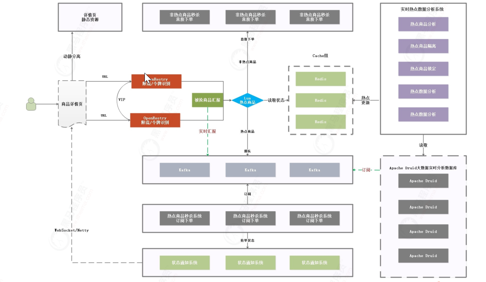

## 秒杀架构

1、商品详情页的内容除了数量变更频率较高，其他数据基本很少发生变更，像这类变更频率低的数据，我们可以考虑 采用模板静态化技术处理。 

2、秒杀系统需要考虑抗压能力，编程语言的选择也有不少讲究。项目发布如果采用Tomcat，单台Tomcat抗压能力能 调整到大约1000左右，占用资源较大。Nginx抗压能力轻飘的就能到5万，并且Nginx占用资源极小，运行稳定。如 果单纯采用Java研发秒杀系统，用Tomcat发布项目，在抗压能力上显然有些不足，如果采用Lua脚本开发量大的功 能，采用Nginx+Lua处理用户的请求，那么并发处理能力将大大提升。    

3、需要区分热点数据和非热点数据，非热点数据直接下单，热点数据因为流量很大，如果不特殊处理，会占用很大一部分资源。特殊处理可以将请求放到kafka队列中进行排队处理，处理完了以后使用Netty返回给客户端。

### 1 ）如何区分热点数据

  #### 1.1 业务分析

日志收集流程如上图，用户请求经过nginx，此时已经留下了用户对某个商品访问的足迹，我们可以在这里将用户 访问的商品信息发送给我们kafka，采用大数据实时分析工具 Apache Druid 实时存储访问信息，再通过程序分析计 算访问情况。    

#### 1.2 Lua收集日志

OpenResty® 是一个基于 Nginx 与 Lua 的高性能 Web 平台，其内部集成了大量精良的 Lua 库、第三方模块以及 大多数的依赖项。用于方便地搭建能够处理超高并发、扩展性极高的动态 Web 应用、Web 服务和动态网关。 OpenResty 通过lua脚本扩展nginx功能，可提供负载均衡、请求路由、安全认证、服务鉴权、流量控制与日志监 控等服务。    

OpenResty® 通过汇聚各种设计精良的 Nginx 模块（主要由 OpenResty 团队自主开发），从而将 Nginx 有效地 变成一个强大的通用 Web 应用平台。这样，Web 开发人员和系统工程师可以使用 Lua 脚本语言调动 Nginx 支持 的各种 C 以及 Lua 模块，快速构造出足以胜任 10K 乃至 1000K 以上单机并发连接的高性能 Web 应用系统。    

用户请求/web/items/1.html，进入到nginx第1个location中，在该location中向Kafka发送请求日志信息，并将请 求中的/web去掉，跳转到另一个location中，并查找本地文件，这样既可以完成日志收集，也能完成文件的访问。    

#### 1.3 热点数据隔离

流程说明：    

1.实时读取Apache Druid的数据 

2.分析哪些数据访问频率高 

3.对访问频率高的数据进行隔离处理，可以把数据单独放到Redis缓存中 

4.用户每次下单的时候，可以先到Redis缓存中检测该商品是否是热点商品，如果不是热点商品，则直接走订单系统下 单，如果是热点商品，则走Kafka排队，不直接下单    

> 1.指定一个时间段内访问频率最高的商品->热点商品 
>
> 2.将热点商品存入到Redis缓存  

 #### 1.4 实时热点数据分析    

我们在热点数据分析系统中查询Druid，然后将热点数据存入到Redis缓存进行隔离。我们可以采用elastic-job每5 秒钟查询一次被访问的商品信息，如果访问量超过1000，我们可以认为是热点数据，并且这里不能查历史访问 量，应该查询近期一段时间，比如最近1天最近1小时最近一分钟等。热点数据查询出来后，我们需要将热点数据隔 离，隔离的方式我们可以直接采用将数据单独存储到Redis的方式隔离。

 热点数据隔离：    

a.编写定时任务‐>定时查询Druid 

b.配置Redis集群‐>热点商品存入到Redis实现隔离 

c.每次定时查询热点商品的时候，需要排除之前已经成为热点商品的数据    