## MySql数据库

### 1）数据结构

#### 1.1 二叉搜索树

树中节点的度不⼤于2的有序树 ，左⼦树的键值总数⼩于根的键值，右⼦树的键值总数⼤于根的键值。

#### 1.2 平衡二叉树

平衡⼆叉树（Balanced Binary Tree）⼜被称为AVL树，且具有以下性质：

它是⼀棵空树或它的左右两个子树的⾼度差的绝对值不超过1，并且左右两个⼦树都是⼀棵平衡⼆叉树。 

#### 1.3 红黑树

红⿊树是⼀种平衡⼆叉查找树的变体，它的左右⼦树⾼差有可能⼤于 1，所以红⿊树不是严格意义上的 平衡⼆叉树（AVL），但对之进⾏平衡的代价较低 。 

#### 1.4 B树

B-Tree是为了**磁盘或其它存储设备**而设计的⼀种多叉平衡查找树，相对于⼆叉树，B-Tree每个内节点有 多个分⽀，即多叉。数据库系统的设计者巧妙利用了磁盘预读原理, 将一个节点的大小设为等于一个页，这样每个节点只需要一次I/O就可以完全载入

B-Tree中的2个概念： 

度数：在树中，每个节点的⼦节点（⼦树）的个数就称为该节点的度（degree）。 

阶数：定义为⼀个节点的⼦节点数⽬的最⼤值。 

m阶B-Tree满⾜以下条件： 

* 每个节点最多拥有m个⼦树 
* 根节点⾄少有2个⼦树 
* 分⽀节点⾄少拥有m/2颗⼦树（除根节点和叶⼦节点外都是分⽀节点） 
* 所有叶⼦节点都在同⼀层、每个节点最多可以有m-1个key，并且以升序排列 
* 每个⾮叶⼦节点由m-1个key和m个指针组成，key和指针互相间隔，节点两端是指针 

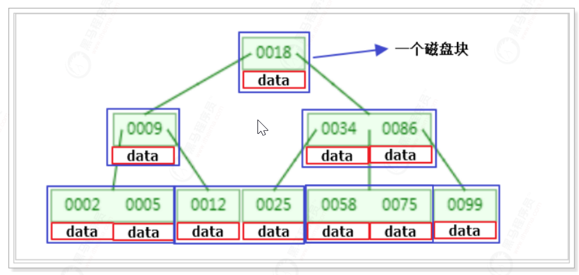

B-Tree相对较⼆叉树的优势在于，⼀次读取⼀个磁盘块数据中包含了多个key数据，这样就可以在内存中 做⽐较操作，减少了磁盘IO的操作。

插⼊或者删除元素都会导致节点发⽣裂变反应，有时候会⾮常麻烦，但正因为如此才让B树能够始终保持 多路平衡，这也是B树⾃身的⼀个优势：⾃平衡； 

B树主要应⽤于⽂件系统以及部分数据库索引，如MongoDB，⼤部分关系型数据库索引则是使⽤B+树实 现。 

#### 1.5 B+树

这是⼀个3阶的B+Tree示意图：

 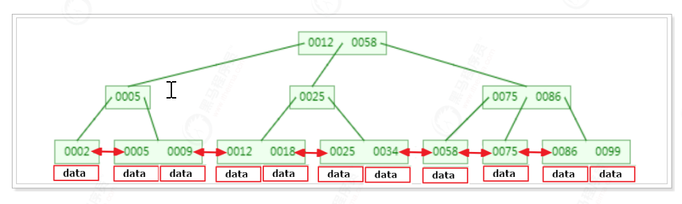

B+Tree是在B-Tree基础上的⼀种优化，使其更适合实现外存储索引结构，InnoDB存储引擎就是⽤ B+Tree实现其索引结构。 

B-Tree结构中可以看到每个节点中不仅包含数据的key值，还有data值。⽽每⼀个块的存储空间是有限 的，如果data数据较⼤时将会导致每个节点（即⼀个块）能存储的key的数量很⼩，当存储的数据量很⼤ 时同样会导致B-Tree的深度较⼤，增⼤查询时的磁盘I/O次数，进⽽影响查询效率。 

在B+Tree中，所有数据记录节点都是按照键值⼤⼩顺序存放在同⼀层的叶⼦节点上，⽽⾮叶⼦节点上只 存储key值信息，这样可以⼤⼤加⼤每个节点存储的key值数量，降低B+Tree的⾼度 。

B+Tree相对于B-Tree有⼏点不同： 

* ⾮叶⼦节点只存储键值信息。 
* 所有叶⼦节点之间都有⼀个链指针。
* 数据记录都存放在叶⼦节点中。 

 在B+Tree中，所有叶⼦节点（即数据节点）之间是⼀种链式环结构（双向）。因此可以对B+Tree进⾏两种查找运 算：⼀种是对于主键的**范围查找和分⻚查找**，另⼀种是从根节点开始，进⾏随机查找。

### 2) B+树深⼊剖析 

#### 2.1、MySQL索引为什么要使⽤B+树 

⾸先需要明确的是，B树或B+树要⽐⼆叉树更适合作为索引存储，因为B树中的节点可以存储多个数据， 从⽽就可以减少树的⾼度，也就减少了提升了查找性能。

那么在MySQL中为什么选择B+树⽽不选择使⽤B树呢？ 

主要原因体现在3个⽅⾯： 

* B+树的磁盘读写代价更低 

  B+树的内部节点并没有指向关键字具体信息的指针，因此其内部节点相对B树更⼩，如果把所 有同⼀内部节点的关键字存放在同⼀盘块中，那么盘块所能容纳的关键字数量也越多，⼀次性 读⼊内存的需要查找的关键字也就越多，相对IO读写次数就降低了。

* B+树的查询效率更加稳定 

  由于⾮终节点并不是最终指向⽂件内容的节点，⽽只是叶⼦节点中关键字的索引。所以任何关 键字的查找必须⾛⼀条从根节点到叶⼦节点的路。 所有关键字查询的路径⻓度相同，导致每⼀个数据的查询效率相当。 

* 由于B+树的数据都存储在叶⼦节点中，分⽀节点均为索引，⽅便扫库，只需要扫⼀遍叶⼦节点即 可，但是B树因为其分⽀节点同样存储着数据，我们要找到具体的数据，需要从根节点按序开始扫 描，所以B+树更加适合在区间查询的情况，所以通常B+树⽤于数据库索引。 

#### 2.2、MySQL索引实现 

##### 2.2.1 MyISAM索引实现 

MyISAM引擎使⽤B+Tree作为索引结构，叶节点的data域存放的是数据记录的地址。下图是MyISAM索 引的原理图： 

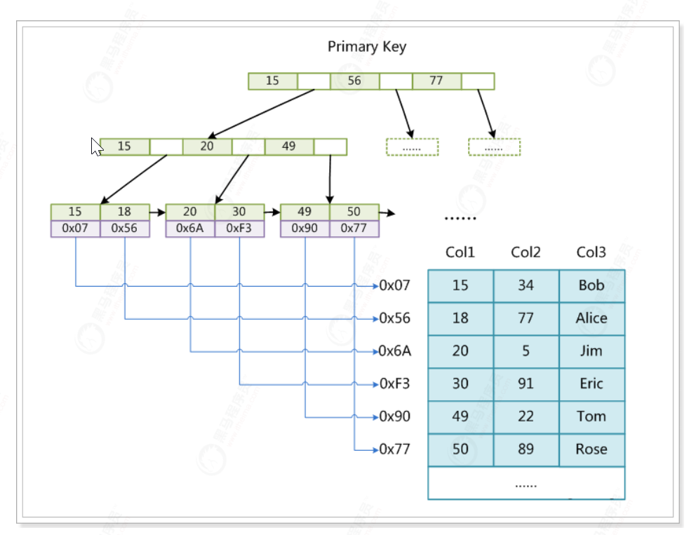

这⾥设表⼀共有三列，假设我们以Col1为主键，上图是⼀个MyISAM表的主索引（Primary key）示意。 

可以看出MyISAM的索引⽂件仅仅保存数据记录的地址，在MyISAM中，主索引和辅助索引（Secondary key）在结构上没有任何区别，只是主索引要求key是唯⼀的，⽽辅助索引的key可以重复。 

如果我们在Col2上建⽴⼀个辅助索引，则此索引的结构如下图所示： 

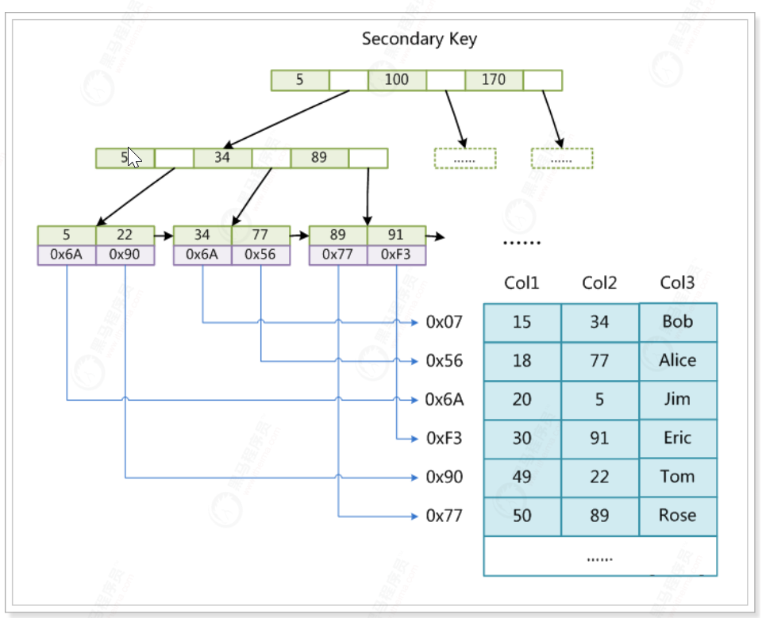

同样也是⼀颗B+Tree，data域保存数据记录的地址。因此，MyISAM中索引检索的算法为⾸先按照 B+Tree搜索算法搜索索引，如果指定的Key存在，则取出其data域的值，然后以data域的值为地址，读 取相应数据记录。 MyISAM的索引⽅式也叫做“⾮聚集”的，之所以这么称呼是为了与InnoDB的聚集索引区分。 

##### 2.2 innoDB索引实现

InnoDB中的索引结构与MyISAM的索引结构有很⼤的不同。

第⼀个重⼤区别是InnoDB的数据⽂件本身就是索引⽂件。在MyISAM中，索引⽂件和数据⽂件是分离 的，索引⽂件仅保存数据记录的地址。⽽在InnoDB中，表数据⽂件本身就是按B+Tree组织的⼀个索引 结构，这棵树的叶节点data域保存了完整的数据记录，这个索引的key是数据表的主键，所以InnoDB表 数据⽂件本身就是主索引 。

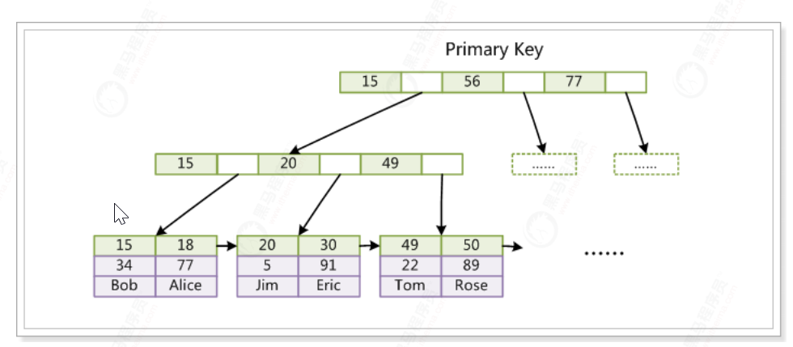

从图中可以看到，叶⼦节点包含了完整的数据记录。这种索引叫做聚集索引。 

> 因为InnoDB的数据⽂件本身要按主键聚集，所以InnoDB要求表必须有主键（MyISAM可以没 有），如果没有显式指定，则MySQL系统会⾃动选择⼀个可以唯⼀标识数据记录的列作为主键， 如果不存在这种列，则MySQL⾃动为InnoDB表⽣成⼀个隐含字段作为主键，这个字段⻓度为6个 字节，类型为⻓整形。（⾯试考题） 

第⼆个与MyISAM索引的不同是，InnoDB的辅助索引data域存储相应记录主键的值⽽不是地址。换句话 说，InnoDB的所有辅助索引都引⽤主键作为data域。例如，下图为定义在Col3上的⼀个辅助索引： 

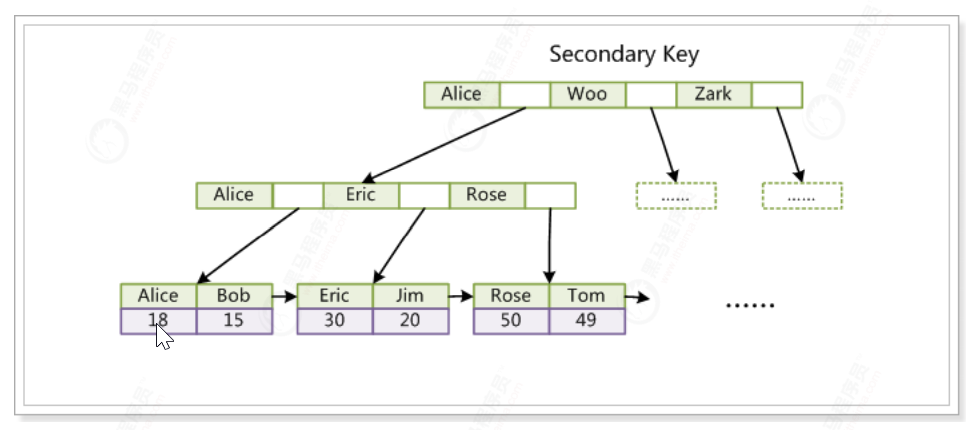

这⾥以英⽂字符的ASCII码作为⽐较准则。聚集索引这种实现⽅式使得按主键的搜索⼗分⾼效，但是辅助 索引搜索需要检索两遍索引：⾸先检索辅助索引获得主键，然后⽤主键到主索引中检索获得记录。 

> InnoDB的B+ 树索引的特点是⾼扇出性，因此⼀般树的⾼度为2~4层，这样我们在查找⼀条记录时 只⽤I/O 2~4次。当前机械硬盘每秒⾄少100次I/O/s，因此查询时间只需0.02~0.04s。

### 3) 索引的使用

#### 3.1 主键索引

在Innodb存储引擎中，每张表都会有主键，数据按照主键顺序组织存放，如果表定义时没有显式定义主 键，则会按照以下⽅式选择或创建主键： 

先判断表中是否有"⾮空的唯⼀索引"，如果有 

* 如果仅有⼀条"⾮空唯⼀索引"，则该索引为主键 
* 如果有多条"⾮空唯⼀索引"，根据索引索引的先后顺序，选择第⼀个定义的⾮空唯⼀索引为主 键。
* 如果表中⽆"⾮空唯⼀索引"，则⾃动创建⼀个6字节⼤⼩的指针作为主键，但是该主键是不能被查询的。 

#### 3.2 联合索引

##### 3.2.1 底层结构

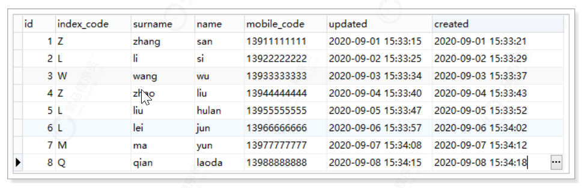

在联系⼈表中，id为主键，index_code,surname,name这三个字段建⽴了联合索引。 

联合索引的底层结构也是基于B+树的，其结构示意图如下： 

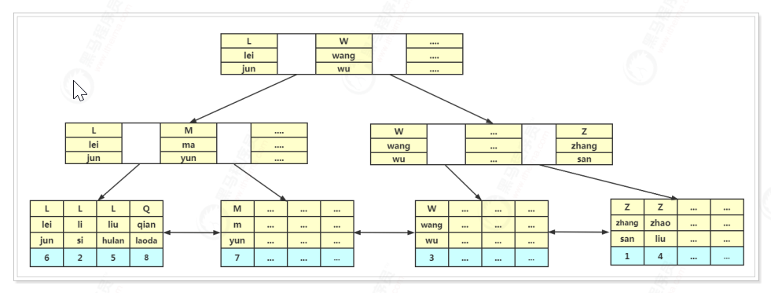

##### 3.2.2 联合索引的查询

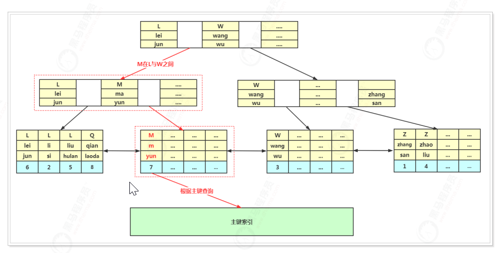

联合索引的执⾏过程如下： ⾸先从根节点开始查找，根节点⼀般是常驻内存中的，第⼀个列为index_code，其值为：M，在L与W之 间，会继续向⼦节点查询

在查找到⼦节点后，将⼦节点数据从磁盘加载到内存中，采⽤⼆分法进⾏查找，找到M ma yun数据符合 条件，再继续查找⼦节点，读取到⼦节点中的data数据，其数据就是这条记录的主键，然后再通过主键 索引查询数据，最终将在主键索引中查询到数据  

### 4) EXPLAIN 

```sql
EXPLAIN <SELECT语句>
--举例：
EXPLAIN SELECT * FROM tb_contact WHERE index_code = 'M'
```

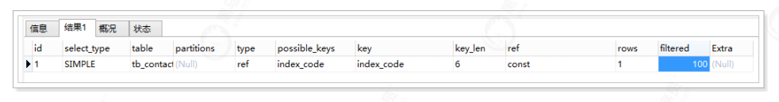

#### 4.1 各列值的意思

##### 4.1.1 id列表 

id列的编号是 select 的序列号，有⼏个 select 就有⼏个id，并且id的顺序是按 select 出现的顺序增⻓ 的。其值越⼤执⾏优先级越⾼，id相同则从上往下执⾏，id为NULL最后执⾏。 

##### 4.1.2 select_type 

表示SELECT语句的类型。 有以下几种类型

* SIMPLE：表示简单查询，其中不包含连接查询和⼦查询。 
* PRIMARY： 表示主查询，或者是最外⾯的查询语句 
* UNION：表示连接查询的第2个或后⾯的查询语句。 
* DEPENDENT UNION：UNION中的第⼆个或后⾯的SELECT语句，取决于外⾯的查询。 
* UNION RESULT： 连接查询的结果 
* UNION RESULT： 连接查询的结果 
* DEPENDENT SUBQUERY：⼦查询中的第1个SELECT语句，取决于外⾯的查询。 
* DERIVED：SELECT(FROM ⼦句的⼦查询) 。

##### 4.1.3 table 

计划执⾏的表，当 from ⼦句中有⼦查询时，table列是 格式，表示当前查询依赖 id=N 的查 询，于是先执⾏ id=N 的查询。 

当有 union 时，UNION RESULT 的 table 列的值为，1和2表 示参与 union 的 select ⾏id。 

##### 4.1.4 type 

这⼀列表示关联类型或访问类型，即MySQL决定如何查找表中的⾏，查找数据⾏记录的⼤概范围。 依次从最优到最差分别为：system > const > eq_ref > ref > range > index > ALL 

* system表仅有⼀⾏，这是const类型的特列，平时不会出现，这个也可以忽略不计。

* const 数据表最多只有⼀个匹配⾏，因为只匹配⼀⾏数据，所以很快，常⽤于PRIMARY KEY或者 UNIQUE索引的查询，可理解为const是最优化的。 

* eq_ref primary key 或 unique key 索引的所有部分被连接使⽤ ，最多只会返回⼀条符合条件的记 录。这可能是在 const 之外最好的联接类型了，简单的 select 查询不会出现这种 type。

  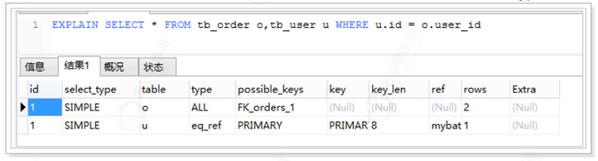

*  ref 相⽐ eq_ref，不使⽤唯⼀索引，⽽是使⽤普通索引或者唯⼀性索引的部分前缀，索引要和某 个值相⽐较，可能会找到多个符合条件的⾏。 

  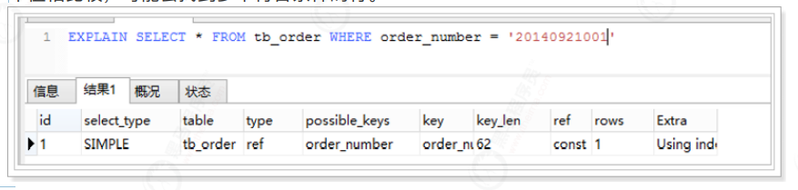

* range 范围扫描通常出现在 in(), between ,> ,<, >= 等操作中。使⽤⼀个索引来检索给定范围的⾏。 

* index 和ALL⼀样，不同就是mysql只需扫描索引树，这通常⽐ALL快⼀些。 

  * 不需要再次扫描主键，索引树上的值刚好是需要查询的值。这也是为什么不建议使用select * 的原因。

* ALL 

  即全表扫描，意味着mysql需要从头到尾去查找所需要的⾏。通常情况下这需要增加索引来进 ⾏优化了 

##### 4.1.5 possible_keys

这⼀列显示查询可能使⽤哪些索引来查找。

explain 时可能出现 possible_keys 有列，⽽ key 显示 NULL 的情况，这种情况是因为表中数据不多， mysql认为索引对此查询帮助不⼤，选择了全表查询。 

如果该列是NULL，则没有相关的索引。在这种情况下，可以通过检查 where ⼦句看是否可以创造⼀个 适当的索引来提⾼查询性能，然后⽤ explain 查看效果。 

##### 4.1.6 key 

显示MySQL实际决定使⽤的键(索引)。如果没有选择索引,键是NULL。

##### 4.1.7 key_len 

这⼀列显示了mysql在索引⾥使⽤的字节数，通过这个值可以算出具体使⽤了索引中的哪些列。 key_len计算规则如下： 

字符串 char(n)：n字节⻓度 varchar(n)：2字节存储字符串⻓度，如果是utf-8，则⻓度 3n + 2 

数值类型 tinyint：1字节 smallint：2字节 int：4字节 bigint：8字节　　 

时间类型　 date：3字节 timestamp：4字节 datetime：8字节 

如果字段允许为 NULL，需要1字节记录是否为 NULL 

##### 4.1.8 ref 

这⼀列显示了在key列记录的索引中，表查找值所⽤到的列或常量，常⻅的有：const（常量），func， NULL，字段名（例：film.id） 

##### 4.3.9 rows 

这⼀列是mysql估计要读取并检测的⾏数，注意这个不是结果集⾥的⾏数。 

##### 4.1.10 Extra  

这⼀列展示的是额外信息。常⻅的重要值如下： 

Distinct：MySQL发现第1个匹配⾏后,停⽌为当前的⾏组合搜索更多的⾏。 

Not exists：MySQL能够对查询进⾏LEFT JOIN优化,发现1个匹配LEFT JOIN标准的⾏后,不再为前⾯ 的的⾏组合在该表内检查更多的⾏。 

range checked for each record (index map: #)：MySQL没有发现好的可以使⽤的索引,但发现如 果来⾃前⾯的表的列值已知,可能部分索引可以使⽤。 

Using filesort（重点）：MySQL会对结果使⽤⼀个外部索引排序，⽽不是按索引次序从表⾥读取 ⾏。此时mysql会根据联接类型浏览所有符合条件的记录，并保存排序关键字和⾏指针，然后排序 关键字并按顺序检索⾏信息。这种情况下⼀般也是要考虑使⽤索引来优化的。 

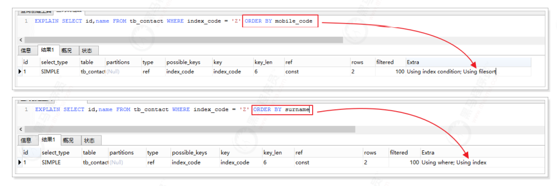

Using index（重点）：从只使⽤索引树中的信息⽽不需要进⼀步搜索读取实际的⾏来检索表中的列 信息

Using temporary（重点）：MySQL需要创建⼀张临时表来处理查询。出现这种情况⼀般是要进⾏ 优化的，⾸先是想到⽤索引来优化。

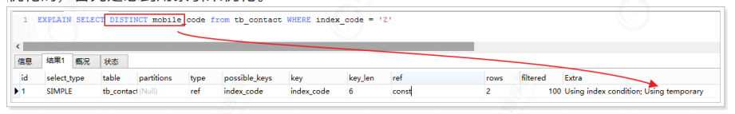

#### 4.2 覆盖索引与回表查询

什么是回表查询？ 先定位主键值，再定位⾏记录，它的性能较扫⼀遍索引树更低，这就是回表查询。 

什么是覆盖索引？ 只需要在⼀棵索引树上就能获取SQL所需的所有列数据，⽆需回表，速度更快。 

```sql
EXPLAIN SELECT * from tb_contact WHERE index_code = 'L'; -- 回表查询
EXPLAIN SELECT id,name from tb_contact WHERE index_code = 'L'; -- 覆盖索引
```

#### 4.3 order by 

* MySQL⽀持两种⽅式的排序filesort和index，Using index是指MySQL扫描索引本身完成排序。 index效率⾼，filesort效率低。
* order by满⾜两种情况会使⽤Using index 
  * order by语句使⽤索引最左前列。 
  * 使⽤where⼦句与order by⼦句条件列组合满⾜索引最左前列。 
* 尽量在索引列上完成排序，遵循索引建⽴（索引创建的顺序）时的最左前缀原则。 
* 如果order by的条件不在索引列上，就会产⽣Using filesort。 

### 5）事务

事务必须满足ACID，但数据库厂商处于各种目的，没有严格去满足ACID事务标准。比如ORACLE 默认事务隔离级别是READ COMMITTED，没有遵循I；MySql 默认是READ REPEATABLE，是满足ACID的。

A -原子性

C-一致性

I-隔离性，使用锁来实现

D-永久性，事务一旦提交，其结果就是永久性的

#### 5.1 事务的实现

I由锁来实现，ACD由redo log 和undo log实现。redo log 叫做重做日志，用于保证事务的原子性和持久性，undo log用来保证事务的一致性。

有的人任务 undo log是redo log的逆过程，其实不是。redo和undo都可以视为一种恢复操作，redo恢复事务提交修改的页操作，而undo回滚到记录某个特定版本。因此记录的内容不同，redo通常是物理日志，记录的是页的物理修改操作，undo是逻辑日志，根据每行记录进行记录。

##### 5.1.1 redo

redo由两部分组成，一是重做日志缓冲，其是易失的；二是重做日志文件，其是持久的。

InnoDB是事务的存储引擎，当事务提交时，必须先将该事务的所有日志写入到重做日志文件进行持久化，待事务的commit操作完成才算完成。

为了确保每次日志都写入重做日志文件，在每次重做日志缓冲写入重做日志文件以后，InnoDB都需要调用一次fsync操作，fsync操作取决于磁盘性能，因为磁盘的性能决定了事务提交的性能，也就是数据库的性能。

InnoDB可以设置等待一定周期后，再fsync，这样可以提高效率，但一旦发生宕机，最后周期的事务会丢失。

**bin-log**

用来PIT的恢复及主从复制的环境建立。表面上看，与重做日志非常相似，都是记录了对数据库操作的日志，然而从本质上来看，却有着非常大的不同点：

1、重做日志是InnoDB层产生的，而二进制文件是MySQL数据库的上层产生的，故二进制文件不仅仅只针对InnoDB存储引擎，所有引擎都能产生二进制文件

2、内容形式不同，二进制文件是逻辑文件，记录的是SQL语句，重做日志则是物理格式的日志，记录对每个页的修改。

3、写入磁盘的时间点不一样，二进制文件只在事务提交完成后一次写入，而重做日志是在事务进行中不断的被写入。

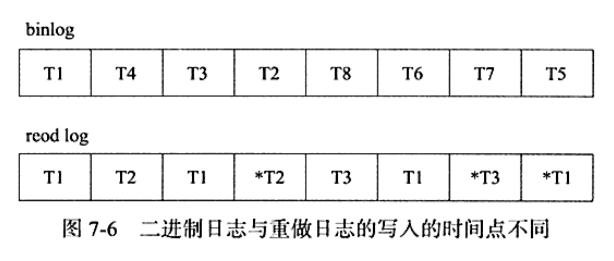

重做日志的每个事务对应多个日志条目，并且事务的重做日志的写入是并发的，并非在事务提交时写入，故其在文件中记录的顺序并非事务的开始顺序，*T1 *T2 *T3表示事务提交时的日志。

4、redo log是幂等的，二进制日志不是幂等（insert）

**log block**

重做日志以512字节进行存储，称之为重做日志块。重做日志块与磁盘扇区大小一致，都是512字节，因此重做日志的写入可以保证原子性，不需要doublewrite技术。

重做日志块的组成：日志块头（12字节）、日志内容（492字节）和日志块尾（8字节）。

#### 5.1.2 undo

undo 存放在数据库内部一个特殊的